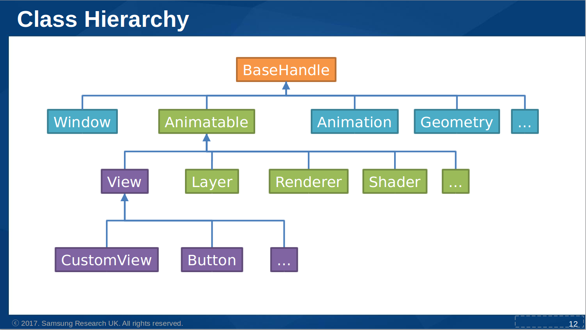
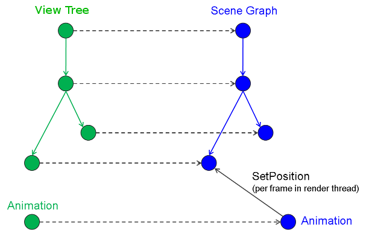

# Animation tutorial

This tutorial describes the NUI animation framework, covering the following subjects:

[Overview](#overview) 
[Animation creation](#creation) 
[Animatable properties](#animatableproperties) 
[Animating properties](#animatingproperties) 
[Controlling animation](#control) 
[Animation Types](#animationtypes) 
[Alpha Functions](#alphafunctions) 
[Events](#events) 
[Animation multithreading](#multithreading) 
[Working example](#workingexample) 
[Animation class methods](#animationclassmethods) 
[Animation class properties](#animationclassproperties) 

## Animation Overview

Animation enables you to create animated effects, by changing object **properties** such as position, for a specified duration.

NUI provides a rich and easy to use animation framework which allows the creation of visually rich applications.

The `Animation` class can be used to animate the [animatable properties](#animatableproperties) of any number of objects, typically View's.

NUI animations occur in a [dedicated thread](#multithreading). This allows animations to run smoothly, regardless of the time
taken to process the input, events, and other factors in the application code.

 This image shows the Animation classes in the NUI class hierarchy. The `Animatable` class contains 'property' 
methods such as `GetProperty` and `IsPropertyAnimatable`. The `Animation` class contains [animation methods](#animationclassmethods)
such as `AnimateBy` and `AnimateTo`.

[Back to top](#top)

### Creating a basic Animation

Here an animation object is created, and the duration of the animation will be 2 seconds:

~~~{.cs}
_animation = new Animation( 2000 );
~~~

alternatively,

~~~{.cs}
_animation = new Animation
{
    Duration = 2000;
};
~~~

[Back to top](#top)

### Animatable Properties

Properties can be 'animatable'. Examples af animatable `View` properties are - Position, Orientation, Scale, Color etc.

For 'standard' controls, the animatable state of a property can be queried (via `IsPropertyAnimatable`), but not changed.

The animatable state can be set in the derived classes of custom view controls.

See also [Properties in custom views](creating-custom-view-controls.md#properties), and [Creating Transitions](creating-custom-view-controls.md#creatingtransitions)
which describes animatable 'Scriptable Properties'.

[Back to top](#top)

### Animating Properties

There are two distinct ways in which properties can be animated within DALi:
- **AnimateTo:** The property will animate **TO** the value in the given time.
- **AnimateBy:** The property will animate **BY** the value in the given time.

Here is an example:

(Assume `view1` and `view2` are at position 10.0f, 10.0f, 0.0f at the start of the animation).
~~~{.cs}
// Animate the position of view1 TO 10.0f, 50.0f, 0.0f
animation.AnimateTo( view1, "Position", Vector3(10.0f, 50.0f, 0.0f) ); 	// End Position: 10.0f, 50.0f, 0.0f

// Animate the position of view2 BY 10.0f, 50.0f, 0.0f
animation.AnimateBy( view2, "Position", Vector3(10.0f, 50.0f, 0.0f) ); 	// End Position: 20.0f, 60.0f, 0.0f
~~~

Another example taken from the working example in this tutorial:
~~~{.cs}
_animation.AnimateTo(_text, "Orientation", new Rotation(new Radian(new Degree(180.0f)), PositionAxis.X), 0, 500, new AlphaFunction(AlphaFunction.BuiltinFunctions.EaseInOutSine));
_animation.AnimateTo(_text, "Orientation", new Rotation(new Radian(new Degree(0.0f)), PositionAxis.X), 500, 1000, new AlphaFunction(AlphaFunction.BuiltinFunctions.EaseInOutSine));

_animation.AnimateBy(_text, "ScaleX", 3, 1000, 1500);
_animation.AnimateBy(_text, "ScaleY", 4.0f, 1500, 2000);
~~~

Properties can also be passed to an animation method via `property` class instantiation:

~~~{.cs}
_animation.AnimateTo(new Property(_text, View.Property.ORIENTATION), new Property.Value(new Rotation(new Radian(new Degree(180.0f)), ...
~~~

See [Animate methods](#animationclassmethods) for explanation of parameters.

[Back to top](#top)

### Playback Control

When an animation is created, it can be played:
~~~{.cs}
animation.Play();
~~~

Stop and Pause are also supported.
~~~{.cs}
animation.Stop();
animation.Pause();
~~~

To loop the animation to play multiple times:

~~~{.cs}
animation.SetLooping(true);
~~~

By default, when an animation ends, the properties that it was animating are 'baked'.
However, the property changes can be **discarded** when the animation ends (or is stopped):

~~~{.cs}
animation.EndAction = Animations.EndActions.Discard;
~~~

[Back to top](#top)

### Events

Applications can be notified when the animation finishes:

~~~{.cs}
_animation.Finished += AnimationFinished;
~~~

~~~{.cs}
public void AnimationFinished(object sender, EventArgs e)
{
    Tizen.Log.Debug("NUI", "AnimationFinished()");
    ...
    ...
}
~~~

Applications can be notified when the animation has reached a given progress percentage:

~~~{.cs}
_animation.ProgressNotification = 0.5; // trigger 'progress reached' event at 50% of animation time

...
...

_animation.ProgressReached += progressReached;
~~~

[Back to top](#top)

### Alpha Functions

Alpha functions are used in animations to specify the rate of change of the animation parameter over time. This allows
the animation to be accelerated, decelerated, repeated or bounced. The built in supported functions can be viewed
in the `AlphaFunction` class.

It is possible to specify a different alpha function for each animator in an Animation object:

~~~{.cs}
animation.AnimateTo(view1, "Position", Vector3(10.0f, 50.0f, 0.0f), new AlphaFunction.BuiltinFunctions.Linear);
~~~

The `AnimateTo` parameters are described in [Animate methods](#animationclassmethods)

The 'built in' alpha functions are :
~~~{.cs}
  public enum BuiltinFunction {
    Default,
    Linear,
    Reverse,
    EaseInSquare,
    EaseOutSquare,
    EaseIn,
    EaseOut,
    EaseInOut,
    EaseInSine,
    EaseOutSine,
    EaseInOutSine,
    Bounce,
    Sin,
    EaseOutBack,
    Count
  }
~~~

The [animation working example](#workingexample) includes the use of a built in alpha function.

You can also create your own alpha function, by setting the default alphafunction:

~~~{.cs}
float alphafunc(float progress)
{
    if ( (progress > 0.2f) && (progress < 0.7f) )
    {
        return progress + 0.8f;
    }
 
    return progress;
}

AlphaFunction af(alphafunc);
animation.SetDefaultAlphaFunction(af);
~~~

or by using delegates:
~~~{.cs}

private UserAlphaFunctionDelegate _user_alpha_func;

...
...

// Declare user alpha function delegate
[UnmanagedFunctionPointer(CallingConvention.StdCall)]
delegate float UserAlphaFunctionDelegate(float progress);

...
...

_user_alpha_func = new UserAlphaFunctionDelegate(alphafunc);

...
...
_animation.AnimateTo(_view2, "Position", new Vector3(150.0f, 150.0f, 0.0f), 5000, 10000, new AlphaFunction(_user_alpha_func));

~~~

[Back to top](#top)

### Animation Types

NUI supports both key-frame and path animation.

#### Key-Frame Animation

NUI provides support for animating between several different values, i.e. key-frames.
A key frame takes a progress value between 0.0f and 1.0f (0 and 100% respectively) and portrays the value of the
property when the animation has progressed that much.

You can create several key frames:

~~~{.cs}
KeyFrames keyFrames = new KeyFrames();
keyFrames.Add( 0.0f, new Vector3( 10.0f, 10.0f, 10.0f ) );
keyFrames.Add( 0.7f, new Vector3( 200.0f, 200.0f, 200.0f ) );
keyFrames.Add( 1.0f, new Vector3( 100.0f, 100.0f, 100.0f ) );
~~~

And then add them to your animation:

~~~{.cs}
animation.AnimateBetween( view1, "Position", keyFrames);
~~~

When the animation runs, NUI animates the position of `view1` between the specified key frames.
`view1` will animate from (10.0f, 10.0f, 10.0f) to (200.0f, 200.0f, 200.0f) by 70% of the animation time,
and then spend the remaining time animating back to (100.0f, 100.0f, 100.0f).

The advantage of specifying a key frame at 0% is that regardless of where `view1` is, it will start from position (10.0f, 10.0f, 10.0f).
If `AnimateTo` was used, then the start position would have been `view1's` current position.

Here is a more comprehensive example of 'Key frame' use, taken from `FocusEffect.cs`:

~~~{.cs}
focusData.ImageItem.Size = new Size(100.0f, 100.0f, 0.0f);
parentItem.Add(focusData.ImageItem);

Size targetSize = focusData.TargetSize;
Size initSize = focusData.InitSize;

...
...

KeyFrames keyFrames = new KeyFrames();

keyFrames.Add(0.0f, initSize);
keyFrames.Add(focusData.KeyFrameStart, initSize);
keyFrames.Add(focusData.KeyFrameEnd, targetSize);

// for halo add an extra keyframe to shrink it ( in 20% of time after it has finished)
if (focusData.Name == "halo")
{
   keyFrames.Add(focusData.KeyFrameEnd + 0.2f, initSize);
}

_animation.AnimateBetween(focusData.ImageItem, "Size", keyFrames, Animation.Interpolation.Linear, new AlphaFunction(AlphaFunction.BuiltinFunctions.EaseOutSine));
~~~

#### Path Animations

A `Path` can be used to animate the position and orientation of views.

The logo will travel to the black points on the diagram. The red points are the control points which
express the curvature of the path on the black points.

Here is the code sample:

~~~{.cs}
Animation animation = new Animation();

...
...

Path path = new Path();
path.AddPoint( new Position( 50.0f, 10.0f, 0.0f ));
path.AddPoint( new Position( 90.0f, 50.0f, 0.0f ));
path.AddPoint( new Position( 10.0f, 90.0f, 0.0f ));
~~~

The control points can be added manually using `AddControlPoint`, or `Path` can auto-generate them for you:

~~~{.cs}
path.GenerateControlPoints(0.25f);
~~~

Here 0.25f represents the curvature of the path you require. The generated control points result in a smooth join
between the splines of each segment.

To animate `view1` along this path:

~~~{.cs}
animation.Animate( view1, path, new Position(0.0f, 0.0f, 0.0f) );
~~~

The third parameter is the forward vector (in local space coordinate system) that will be oriented with the path's
tangent direction.

Another example:

~~~{.cs}
// black points	 
Position position0 = new Position(200.0f, 200.0f, 0.0f);
Position position1 = new Position(300.0f, 300.0f, 0.0f);
Position position2 = new Position(400.0f, 400.0f, 0.0f);

Path path = new Path();
path.AddPoint(position0);
path.AddPoint(position1);
path.AddPoint(position2);

// Control points for first segment
path.AddControlPoint(new Vector3(39.0f, 90.0f, 0.0f));
path.AddControlPoint(new Vector3(56.0f, 119.0f, 0.0f));

// Control points for second segment
path.AddControlPoint(new Vector3(78.0f, 120.0f, 0.0f));
path.AddControlPoint(new Vector3(93.0f, 104.0f, 0.0f));

Animation animation = new Animation();
animation.AnimatePath(view, path, Vector3.XAxis, 0, 5000, new AlphaFunction(AlphaFunction.BuiltinFunctions.Linear)); // X Axis
animation.Play();
~~~

Note: `AnimatePath` invokes `Animate`.

[Back to top](#top)

### Multi-threaded Architecture

NUI animations and rendering occur in a dedicated rendering thread. This allows animations to run smoothly, regardless of the time
taken to process events in application code.

Internally NUI contains a scene-graph, which mirrors the views hierarchy. The scene-graph objects perform the actual animation and
rendering, whilst views provide thread-safe access.

An example view hierarchy is shown below, in which one of the views is being animated. The objects in green are created by the
application code, whilst the private objects in blue are used in the dedicated rendering thread.

#### Reading an animated value

When a property is animatable, it can only be modified in the rendering thread. The value returned from a 'get' property, is the value
used when the previous frame was rendered.

For example `pos = view.Position` returns the position at which the view was last rendered. Since setting a position i.e. `view.Position = pos`
is asynchronous, `pos = view.Position` won't immediately return the same value.

~~~{.cs}
// Whilst handling an event...

View view = new View();
Window.Instance.Add(view); // initial position is 0,0,0
view.Position = new Position(10,10,10);

Position current = view.Position;
Console.WriteLine("Current position: " + current.X + ", " + current.Y + ", " + current.Z);
Console.WriteLine("...");

// Whilst handling another event...

current = view.Position;
Console.WriteLine("Current position: " + current.X + ", " + current.Y + ", " + current.Z);
~~~

The example code above would likely output:

~~~{.cs}
Current position: 0,0,0
...
Current position: 10,10,10
~~~

#### Setting a property during an animation

When a property is being animated, the Animation will override any values set.

The order of execution in the render thread is:

~~~{.sh}
1. Process message => SetPosition
2. Apply animation => SetPosition
3. Render frame
~~~

### Animation example

A simple text animation example has been created to illustrate some of the principles outlined in this guide, including the use of the
`AnimateBy`, `AnimateTo` methods and an alphafunction.

Read the instructions in [Building NUI source code](setup-ubuntu.md#buildnui) of the ubuntu setup guide, which includes an explanation
of where to place tutorial files. (_'nuirun' folder_).

1. Download [Animation example source code](http://dalihub.github.io/NUIsetup/animation-hello-world-tutorial.cs)
2. Copy this file to your 'nuirun' folder, (or ../nuirun/tutorials).

~~~{.sh}
cp animation-hello-world.cs ~/DALiNUI/nuirun/tutorials
~~~

[Back to top](#top)

### Animate methods

The `Animation` class provides a series of overloaded methods for animation of properties, including:

* **AnimateBy** animates a property value by a relative amount.

~~~{.cs}
public void AnimateBy(View target, string property, object relativeValue, AlphaFunction alphaFunction = null)
~~~

~~~{.cs}
public void AnimateBy(View target, string property, object relativeValue, int startTime, int endTime, AlphaFunction alphaFunction = null)
~~~

| Parameter       | Description |
| --------------- |------------ |
| _target_        | The target object to animate            |
| _property_      | The target property to animate, can be enum or string            |
| _relativeValue_ | The property value will change by this amount            |
| _alphaFunction_ | The alpha function to apply            |
| _startTime_     | Start time of animation            |
| _endTime_       | End time of animation            |

* **AnimateTo** animates a property to a destination value.

~~~{.cs}
public void AnimateTo(View target, string property, object destinationValue, AlphaFunction alphaFunction = null)
~~~

~~~{.cs}
public void AnimateTo(View target, string property, object destinationValue, int startTime, int endTime, AlphaFunction alphaFunction = null)
~~~

* **AnimateBetween** animates a property between [key frames](#animationtypes).

~~~{.cs}
public void AnimateBetween(View target, string property, KeyFrames keyFrames, Interpolation interpolation = Interpolation.Linear, AlphaFunction alphaFunction = null)
~~~

~~~{.cs}
public void AnimateBetween(View target, string property, KeyFrames keyFrames)
~~~

| Parameter       | Description |
| --------------- |------------ |
| _keyFrames_     | The set of time/value pairs between which to animate       |
| _interpolation_ | The method used to interpolate between values    |

* **AnimatePath** animates a view's position and orientation through a predefined path.

~~~{.cs}
public void AnimatePath(View view, Path path, Vector3 forward, AlphaFunction alphaFunction = null)
~~~

| Parameter       | Description |
| --------------- |------------ |
| _path_          | Defines position and orientation     |
| _forward_       | The vector (in local space coordinate system) that will be oriented with the path's tangent direction |

[Back to top](#top)

### Animation class properties

`Animation` class properties include:

| Property               | Type            | Description |
| -----------------------| --------------- | ------------ |
| Duration               | int             | Gets/Sets the duration in milli seconds of the animation. |
| DefaultAlphaFunction   | AlphaFunction   | Gets/Sets the default alpha function for the animation. |
| State                  |     States      | Queries the 'state' of the animation. (_Stopped_, _Playing_ or _Paused_) |
| LoopCount              |      int        | Set : Enables looping for 'count' repeats. A zero is the same as Looping = true; i.e. repeat forever |
|                        |                 | Get : Gets the loop count. |
| Looping                |     bool        | Gets/Sets the status of whether the animation will loop. (resets the loop count). The loop count is initially 1 for play once. |
| EndAction              |   EndActions    | Gets/Sets the end action of the animation. This action is performed when the animation ends, or if it is stopped |
| CurrentLoop            |   int           | Gets the current loop count |
| DisconnectAction       |   EndAction     | Gets/Sets the disconnect action. |
| CurrentProgress        |     float       | Gets/Sets the progress of the animation. |
| SpeedFactor            |     float       | Gets/Sets specifies a speed factor for the animation. |
| PlayRange              | RelativeVector2 | Animation will play between the values specified. Both values(range.x and range.y ) should be between 0 and 1 |
| ProgressNotification   |    float        | Gets/Sets the Progress notification marker which triggers the ProgressReached Event, should be between 0 and 1 |

[Back to top](#top)

