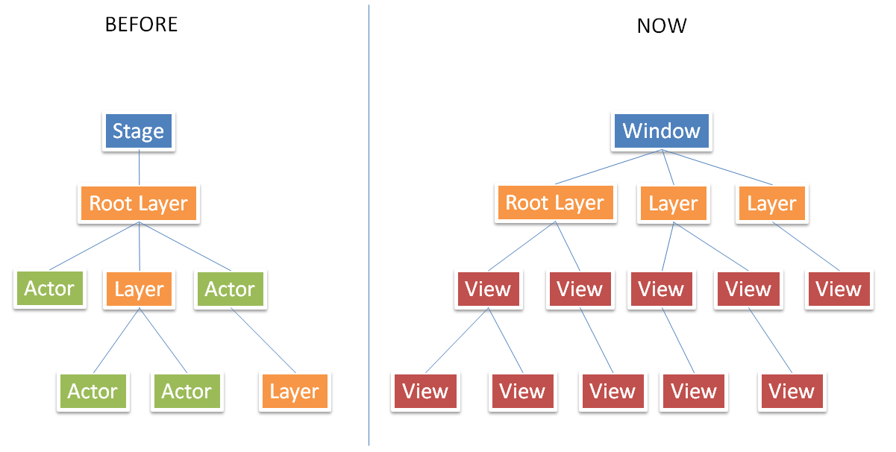

# NUI and DALI differances overview (as at May 2017)

This overview describes the recent changes in the NUI API interface

## key NUI API interface changes

The NUI API has been modified from its original C# base.

+ THe NUI API was changed in order to minimise the number of API's exposed but unrequired in C#. This was partially
  to do with the Handle/Body idiom which has to be exposed to application developers in C++ but is available by default
  in C#.

+ Actor has been removed, all actor properties have been moved to View. View is the basic building block for a UI. Views can
  can be added to other Views or Layers.

+ A layer no longer inherits from Actor. All relevant Actor properties (e.g. Position, size) that applied to layer, were moved into Layer as well.
  A Layer can only be added at the top level. It is no longer possible to add a Layer to a View (considered unnecessary).

+ Both Layer and View now inherit from a new Animatable class. An Animatable class's properties can be animated by using the
  Animation class.

+ Window and Stage have been combined solely into the Window class. To add a View or Layer to the scene, add them to the Window.
  The Window can be used to retrieve the list of Layers.

## Relationship Between NUI code and original DALi code

Currently all C# functionality is simply a wrapper around the existing native C++ API. It is conceivable in
future that new UI elements may be developed in C# that have no direct C++ version (_though would still use the
native C++ API where required_).

## Development of NUI from DALi

DALi was originally developed in C++, then subsequently developed in parallel in C#. A seperate Tizen
NUI branch was created from this C# DALi branch.
