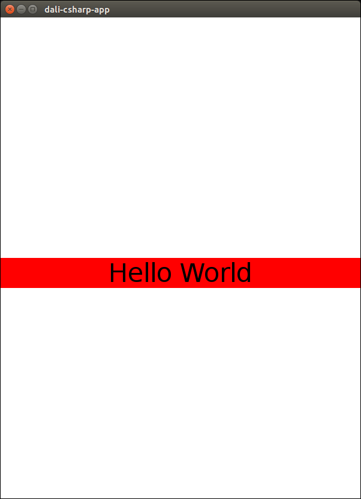

# NUI Hello World Tutorial

The tutorial shows how to create and display "Hello World" using a text label.

[The NUI Overview](NUIoverview.md) is an introduction to NUI.

## Explanation of tutorial

The following steps are required to display text:

+ Initialise the NUI library
+ Create a View - a text label showing text
+ Add the text label to the application main window

This tutorial also demonstrates the triggering (_firing_) of the _Touch_ window application event.

[Hello World code](#fullcode)

### Namespaces

The required system and NUI namespaces are imported via the using declarations:

   ~~~{.cs}
   using System;
   using System.Runtime.InteropServices;
   using Tizen.NUI;
   using Tizen.NUI.UIComponents;
   using Tizen.NUI.BaseComponents;
   using Tizen.NUI.Constants;
   ~~~

This application is scoped to the 'HelloTest' namespace.

### Main method

The Main method consist of 2 steps:

1. Creation of application via the default constructor.

   ~~~{.cs}
   Example example = new Example();
   ~~~

   The application is derived from the Tizen NUI application class - _NUIApplication_.

   ~~~{.cs}
   class Example : NUIApplication
   ~~~

   _The NUIApplication class also includes constructors enabling application creation with stylesheets and window modes_.

2. Start of application main loop

   The main loop must be started to run the application. This ensures that images are displayed,
   and events and signals are dispatched and captured.

   ~~~{.cs}
   example.Run(args);
   ~~~

   In this simple tutorial, the Main method resides within the class. For significant application development, the Main
   method should be placed in a seperate .cs file.

### The Creation method - OnCreate()

The _hello world_ `OnCreate` method, overrides the NUIApplication `OnCreate` function: 

   ~~~{.cs}
   base.OnCreate();
   Initialize();
   ~~~

Hence we can incorporate the required initialization behaviour in our application.

Note: `base.OnCreate` is necessary to invoke the 'created' event.

### The Initialization method - Initialize()

The initialization code contains the following simple steps:

1. Creation of the text label member variable.

   ~~~{.cs}
   _text = new TextLabel("Hello World");
   ~~~

2. Positioning the text in centre of application window. The _ParentOrigin_ defines a point
   within the parent views's area. Note: The text label will be at least the
   width of the screen if the text label size is not specified.

   ~~~{.cs}
   _text.ParentOrigin = ParentOrigin.CenterLeft;
   ~~~

3. Alignment of text horizontally to the center of the available area.

   ~~~{.cs}
   _text.HorizontalAlignment = HorizontalAlignment.Center;
   ~~~

4. Setting label background color to illustrate label width.

   ~~~{.cs}
   _text.BackgroundColor = Color.Red;
   ~~~

5. Setting text size. The size of the font in points.

   ~~~{.cs}
   _text.PointSize = 32.0f;
   ~~~

6. Adding the _Touch_ event handler to the main application window. This event handler is invoked
   on any click in the application window.

   ~~~{.cs}
   Window window = Window.Instance;
   window.TouchEvent += WindowTouched;
   ~~~

   [Adding the Touch event handler with lambda expressions](#lambda), is an alternative.

7. Adding text to the root layer.

   ~~~{.cs}
   window.Add(_text);
   ~~~

   The window will add the view to the root layer.

### The Touch event handler

The user can click anywhere in the application window to change the text in the label:

~~~{.cs}
    private void WindowTouched(object sender, Window.TouchEventArgs e)
    {
        _text.Text = "I have been touched!";
    }
~~~

### Closing the application - OnTerminate()

`OnTerminate` is invoked when the application is about to terminate.

`OnTerminate` is invoked by selection of the window close button.

Note: `base.OnTerminate` is necessary to invoke the 'deleted' event.

### Build and Run the application

Use Visual Studio on a Windows platform. Use Visual Studio Code on Linux.

The [NUI development setup guide](setup-ubuntu.md) describes setting up the NUI development environment
on Ubuntu, using this tutorial as an example project.

## Full example code

~~~{.cs}
using System;
using System.Runtime.InteropServices;
using Tizen.NUI;
using Tizen.NUI.UIComponents;
using Tizen.NUI.BaseComponents;
using Tizen.NUI.Constants;

namespace HelloTest
{
    class Example : NUIApplication
    {
        TextLabel _text;

        protected override void OnCreate()
        {
            base.OnCreate();
            Initialize();
        } 

        private void Initialize()
        {
            // Add a simple text label to the main window
            _text = new TextLabel("Hello World");
            _text.ParentOrigin = ParentOrigin.CenterLeft;
            _text.HorizontalAlignment = HorizontalAlignment.Center;
	    _text.BackgroundColor = Color.Red;
            _text.PointSize = 32.0f;

            // Connect the signal callback for a touch signal
            Window window = Window.Instance;
            window.TouchEvent += WindowTouched;
        
            window.Add(_text);
        }

        // Callback for main window touched signal handling
        private void WindowTouched(object sender, Window.TouchEventArgs e)
        {
            _text.Text = "I have been touched!";
        }

        protected override void OnTerminate()
        {
            base.OnTerminate();
            _text = null;
        }

        static void Main(string[] args)
        {
            Example example = new Example();
            example.Run(args);
        }
    }
}
~~~

## Example output

After running the example, the following output should appear:

### Alternate method of adding the Touch event, using lambda expression syntax

~~~{.cs}
window.TouchEvent += (object src, Window.TouchEventArgs args) =>
{ // code
    _text.Text = "I have been touched!";
};
~~~

### More information on the Text label 

The [Text Label tutorial](text-label.md) describes the key properties of the text label in detail.

[Back to top](#top)

