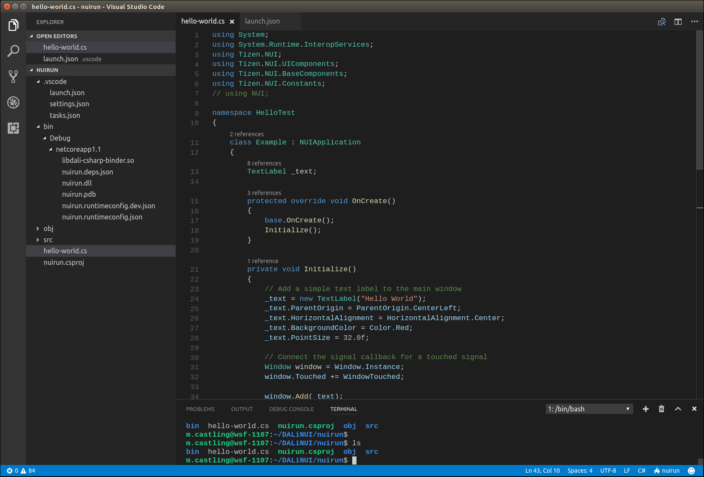
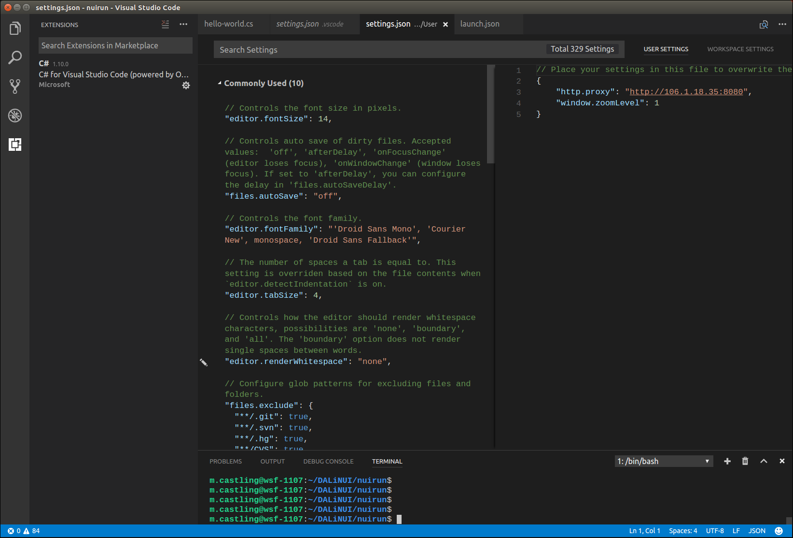

# Setting up the NUI development environment on Ubuntu

This guide explains how to setup, build and run NUI (DALi C#) applications using Visual Studio Code (VSC).

It assumes the starting point is a completely 'clean' system, though that is not essential.

VSC can be be installed on Ubuntu 14.04 and onwards.

The [NUI Hello World tutorial](hello-world.md#fullcode) provides an introduction into NUI application development,
describing how to display text in a text label.

## Overview
This document covers:

[Installation of .NET Core and VSC](#install) 
[Getting NUI source code](#getsrc) 
[NUI build environment](#buildenv) 
[Building NUI source code](#buildsrc) 
[Build and run the Hello World tutorial](#buildrun) 
[Appendix A - Configuring firewall proxy settings](#firewall) 
[Appendix B - Clean build](#buildclean) 

## Step-by-step guide

### Installation of .NET Core and Visual Studio Code (VSC)

* Install .NET Core for Ubuntu
    1. Follow instructions for [installing .NET Core for Ubuntu](https://www.microsoft.com/net/core#linuxubuntu)

* Install latest VSC for Ubuntu
    1. [Download deb package](https://code.visualstudio.com).
    2. Install deb package, the VSC instructions are to use:
~~~{.sh}
    $ sudo dpkg -i code_1.10.2xXXXXXXXXXX_amd64.deb
~~~

* Alternatives for opening VSC via the icon
    1. In the desktop launcher, select _Search your Computer_ > _Applications_ for the Visual Studio Code icon.
    2. Select the _Launch_ button to open VSC
    3. Copy VSC icon to Launcher.
    4. Subsequently, can Double click on the VSC icon in Launcher.

* Alternatives for opening VSC from a terminal
 1. Open VSC
~~~{.sh}
    $ code
~~~

 2. Open VSC in current directory
~~~{.sh}
    $ code .
~~~

 3. Open file in VSC
~~~{.sh}
    $ code myfile
~~~

* Firewall proxy settings

VSC requires installation of required packages and libraries. It may be necessary to configure the firewall
proxy settings to enable download via http. The procedures for firewall setup are described in [Appendix A](#firewall).

* Install C# extension from within VSC, via the Extensions View
    1. Bring up the Extensions view by clicking on the extensions icon in the Activity Bar, or `Ctrl+Shift+X` (View extensions command).
    2. This will bring up all the extensions in the VS code marketplace.
    3. Click the Install button next to C#. After a successful install, you will see the Reload button, click to restart VSC.

* Alternatively, [Install_C# extension_from VSC marketplace](https://marketplace.visualstudio.com).

#### Recommended - Familiarisation with VSC

* Build VSC with a console hello world

[Getting started with Visual Studio code](https://docs.microsoft.com/en-us/dotnet/csharp/getting-started/with-visual-studio-code)
will give you a basic understanding of projects in VSC.

[Back to top](#top)

### Get NUI source code from Git

* Create a 'NUI root folder' for the source code, _I am using ~/DALiNUI as an example_
~~~{.sh}	
    $ mkdir ~/DALiNUI
    $ cd ~/DALiNUI
~~~

* Get code from GitHub

~~~{.sh}
    $ git clone git@github.com:dalihub/dali-core
    $ git clone git@github.com:dalihub/dali-adaptor
    $ git clone git@github.com:dalihub/dali-csharp-binder
    $ git clone git@github.com:dalihub/dali-toolkit
    $ git clone git@github.com:dalihub/nui
~~~

* Switch to the 'devel/master' branch for each required repo, i.e for dali-core:
~~~{.sh}
    $ cd ~/DALiNUI/dali-core
    $ git checkout devel/master
~~~

[Back to top](#top)

### NUI build environment

* Build environment setup, saving to a file:

~~~{.sh}
    $ cd ~/DALiNUI
    $ dali-core/build/scripts/dali_env -c
    $ dali-env/opt/bin/dali_env -s > setenv
    $ . setenv
~~~

These steps only need to be done once.

You will have to source your environment variables every time you open up a new terminal (or you can add to `.bashrc` if you prefer).
You can do this by sourcing the ''setenv'' script you created above: 

~~~{.sh}
    $ . setenv
~~~

[Back to top](#top)

### Building NUI source code

* Build DALi *native* repo's in the following order, follow instructions in the README file in each repo folder.
    1. Build dali-core
    2. Build dali-adaptor
    3. Build dali-toolkit

_The shared library files (.so) will be built and installed into the ~/DALiNUI/dali-env/opt/lib_ folder.

* Optional - Run and test DALi Native (C++)
    1. Get code - this step requires the _dali_demo_ repo:
    2. Build from README file (_"Building the Repository"_ section)
    3. Run dali-demo

~~~{.sh}
    $ git clone git@github.com:dalihub/dali-demo
    $ cd ~/DALiNUI/dali-demo
    $ git checkout devel/master

    Build from README

    $ cd ~/DALiNUI/dali-env/opt/bin
    $ dali-demo
~~~

If ok, DALi demo window will appear.

* Move to NUI csharp bindings folder

~~~{.sh}
    $ cd dali-csharp-binder/dali-csharp-binder
~~~

* NUI csharp bindings - remove dependency
    1. Edit _file.list_ and remove the line "src/key-grab.cpp \". (_This is a tizen only dependency_). Do not leave a gap in the file.
    2.. Change directory to 'parent' binder folder
~~~{.sh}
    $ cd ~/DALiNUI/dali-csharp-binder
~~~

* Build NUI csharp bindings
    1. Build bindings by following the README file. (_"Building the Repository"_ section)

* Copy the `nui` source folder to a new sub-folder `nuirun` (_for subsequent overwriting of files_)

~~~{.sh}
    $ cd ~/DALiNUI
    $ mkdir nuirun
    $ cp -r nui/Tizen.NUI/src nuirun
~~~

* Overwrite two NUI files in ~/DALiNUI/nuirun/src/public
    1. Download [CoreUIApplication.cs](http://dalihub.github.io/NUIsetup/CoreUIApplication.cs)
    2. Download [NUIApplication.cs](http://dalihub.github.io/NUIsetup/NUIApplication.cs)
    3. Place these files in your nuirun/src/public folder (You will have to overwrite NUIApplication.cs).

_Overwriting these 2 files is necessary, as NUI in Ubuntu is not fully supported just yet._

* To subsequently clean the build (if required), see [Appendix B](#buildclean)

[Back to top](#top)

### Build NUI and Run the Hello World (NUI) Tutorial

* Create tutorial file 
    1. Copy code in _"full example"_ section of the [NUI Hello World tutorial](hello-world.md) to a new file, `hello-world.cs`
    2. Copy `hello-world.cs` to the nuirun folder:
~~~{.sh}
    $ cp hello-world.cs ~/DALiNUI/nuirun
~~~

* Create a 'Hello World' project in VSC
    1. [Open VSC](#install)
    2. Select File > Open Folder in the main menu.
    3. Select the `nuirun` folder in the File Dialog
    4. Open the command prompt CTRL+` (backtick)
    5. In the Integrated Terminal, type the following:
~~~{.sh}
    $ cd ~/DALiNUI
    $ . setenv
    $ cd ~/DALiNUI/nuirun
    $ dotnet new console
~~~

The 'setenv' will not be necessary, if the environment has been set up in your .bashrc as described in [Build environment](#buildenv))

The 'dotnet new console' creates a Project, with a Project file `nuirun.csproj` and a `Program.cs` file.

+ Delete Program.cs in VSC Explorer, as its not needed.

+ Modify project file
    1. Edit `nuirun.csproj`, adding the following line inside the 'PropertyGroup' element:
~~~{.sh}
    <DefineConstants>DOT_NET_CORE</DefineConstants>
~~~

+ Build assets
    1. Restore the dependencies and tools of a project.
~~~{.sh}
    $ dotnet restore
~~~

Running `dotnet restore` gives you access to the required .NET Core packages that are needed to build your project.

+ Configure VSC by creating tasks.json
    1. Press `Ctrl+Shift+P` to open the command Pallete, type "ctr", and select Configure Task runner > NET core

A `tasks.json` file is essential, or else will get "No task runner configured", or "Error Could not find the Pre Launch Task 'build'"
message pane on building.

+ Build
~~~{.sh}
    $ dotnet build
~~~

Note: This step builds the 'nui' library.

The screenshot shows the key files associated with the "hello world" project in VSC Explorer.

* Copy shared library to application runtime location:
~~~{.sh}
   cp  dali-env/opt/lib/libdali-csharp-binder.so ~/DALiNUI/nuirun/bin/Debug/netcoreapp1.1/
~~~

+ To Run full size application in VSC integrated terminal
~~~{.sh}
    $ dotnet run
~~~

+ To Run adjusted size application in VSC integrated terminal
~~~{.sh}
    $ DALI_WINDOW_WIDTH=600 DALI_WINDOW_HEIGHT=800 dotnet run
~~~

#### Modify Hello World Application window size

This section provides an insight into the configuration of the application "Launch" profile.

In VSC, Open `launch.json` via the Explorer. In the "configurations" section, add the required width and height
to the environment variable:

~~~{.sh}
    "name": ".NET Core Launch (console)",

    ...
    ...
    "env": {
        "DALI_WINDOW_WIDTH":"600",
        "DALI_WINDOW_HEIGHT":"800"
    },

These settings will be picked up if the application is run via F5.
~~~

[Back to top](#top)

### Appendix A - Configuring Firewall proxy settings

* Setup System firewall Proxy settings for VSC _enable install of the VSC C# extension package_
    1. On desktop, select **System Settings > Network > Network Proxy > HTTP Proxy** and type the IP address, including port number
    2. On desktop, select **System Settings > Network > Network Proxy > HTTPS Proxy** and type the IP address, including port number

* Configure VSC firewall proxy settings (_for install of library packages such as mono runtime and .NET Core Debugger_) 
    1. Select File > Preferences > Settings > Edit
    2. Select HTTP in middle pane
    3. Select Edit icon > Copy to settings. "http.proxy" should be copied to right hand pane:
~~~{.sh}
    {
       "http.proxy":
    }
~~~

* Add the proxy setting:
~~~{.sh}
    {
       "http.proxy": "http://xxx.xxx.xxx.xxx:xxxx
    }
~~~

The proxy settings are saved to the `settings.json` file.

The screenshot shows the installed C# extension package, and also the proxy settings for the library packages
in the `settings.json` file.

* OR Set the OS environment variables `http_proxy` and `https_proxy`, in a terminal from which VSC will be run
~~~{.sh}
   $ export http_proxy=http://xxx.xxx.xxx.xxx
   $ export https_proxy=http://xxx.xxx.xxx.xxx
~~~

These export variables could also be set in your `.bashrc` file.

### Appendix B - Clean build

To clean the NUI Build:
~~~{.sh}
    $ make maintainer-clean	
~~~

[Back to top](#top)

