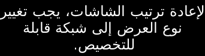
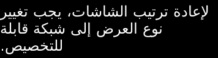
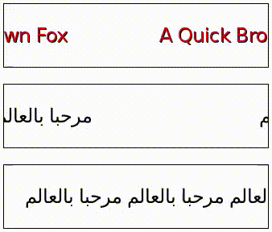

# Text Label Tutorial

This tutorial describes the _TextLabel_ control in detail.

In this tutorial:

[Text Label creation](#1) 
[Font selection](#2) 
[Multi-language support](#3) 
[Text alignment](#4) 
[Label decorations](#5) 
[Auto scrolling](#6) 
[Mark style](#7) 
[Text Label Properties](#8) 

## Overview

The TextLabel is a NUI control which renders a short text string.  

Text labels are lightweight, non-editable and do not respond to user input. Text labels also offer
multi-language support.

### Basic creation and usage

~~~{.cs}
TextLabel label = new TextLabel("Hello World");
Window window = Window.Instance;
window.Add(label);
~~~

The label must be added to the Window, or to a View which is on the Window.

The position of the label on-screen is dependent on the *parentOrigin* property.

This image shows a text label with ParentOrigin.TopLeft:

To display a TextLabel the _Text_ property must be set using a UTF-8 string.
Note: *CR+LF* new line characters are replaced by *LF*.

### Font Selection

By default the TextLabel will automatically select a suitable font from the platform. Note; that the selected font
may not support all characters in your input text. For example, Latin fonts often do not provide Arabic glyphs.

Alternatively you can request a font using either or all, of _FontFamily_, _FontStyle_, and _PointSize_ properties:

- Font Family
  Is a string with the font's family name. i.e. *FreeSerif*

- Font Style
  Is a JSON formatted string with the font's style. Possible *key, value* pairs are:
  + *width* Modifies the space between glyphs. Commonly used values are:
    - *condensed*
    - *semiCondensed*
    - *normal*
    - *semiExpanded*
    - *expanded*
  + *weight* Modifies the thickness or darkness of the glyphs. Commonly used values are:
    - *thin*
    - *light*
    - *normal*
    - *regular*
    - *medium*
    - *bold*
  + *slant* Whether to use italics. Usually *italic* is a different font, whilst the *oblique* has been generated by slanting the *normal* one. Commonly used values are:
    - *normal*
    - *roman* Same as *normal*
    - *italic*
    - *oblique*

- Point Size
  Is a float with the font's size in points. To get the point size from pixels, could use the formula: <em>point_size = 72 * pixels / vertical_dpi</em>
  where <em>vertical_dpi</em> is the device's vertical resolution in dots per inch.

~~~{.cs}
label.FontFamily = "FreeSerif";

PropertyMap fontStyle = new PropertyMap();
fontStyle.Add( "weight", "bold" );
fontStyle.Add( "slant", "italic" );
label.FontStyle = fontStyle;
label.PointSize = 12.0f;

If fonts are not specified, styling defaults are used.
~~~

#### Font Styles

Setting a font size programmatically is not ideal for applications which support multiple
screen resolutions, and platforms which support multiple logical font sizes.  Also, any
changes to the platform font settings will override any sizes that have been programmatically
set.

A more flexible approach is to prepare various JSON stylesheets, and request a different style for each platform.
The NUIApplication class has constructors which take a stylesheet argument:

~~~{.cs}
class Example : NUIApplication

...
...

Example example = new Example("example-path/example.json");
~~~

To change the font for standard text controls, this JSON syntax can be used:

~~~{.json}
{
  "styles":
  {
    "textlabel":
    {
      "fontFamily":"FreeSerif",
      "fontStyle":
      {
        "weight":"bold",
        "slant":"italic"
      },
      "pointSize":8
    }
  }
}
~~~

However the same pointSize is unlikely to be suitable for all text controls in an application.
To define custom styles for existing controls, simply set a style name for each case, and
then provide a style override in JSON.

Mapping (_in the stylesheet_) the logical size to a physical size, can provide further flexibility
for the end user.

### Multi - language support
Text labels offer multi-language support, including 'right to left' languages such as Arabic.

An example of Arabic can be seen in the images in the [Text Alignment](#4) section.

See also [Font Selection](#2) 

[Back to top](#0)

### Text Alignment

Wrapping can be enabled using the _MultiLine_ property:

~~~{.cs}
label.MultiLine = true;
~~~

The text can be aligned horizontally to the beginning, end, or center of the available area:

~~~{.cs}
label.HorizontalAlignment = HorizontalAlignmentType.Left;
label.HorizontalAlignment = HorizontalAlignmentType.Center;
label.HorizontalAlignment = HorizontalAlignmentType.Right;
~~~

|  |  |
|--|--|
| Here is the "BEGIN" alignment shown for left-to-right (Latin)   |  right-to-left (Arabic) scripts |
|  |  |
| Here is the "CENTER" alignment shown for left-to-right (Latin)  | right-to-left (Arabic) scripts:|
|  |  |
| Here is the "END" alignment shown for left-to-right (Latin)  | right-to-left (Arabic) scripts:|
|  |  |

The examples above assume that the label size is greater than the minimum required.
[Back to top](#0)

### TextLabel Decorations

#### Color

To change the color of the text, the recommended way is to use the TEXT_COLOR property.  
Note that unlike the View COLOR property, this will not affect child Actors added to the TextLabel.  

~~~{.cs}
label.Text = "Red Text";
label.TextColor = Color.RED;
~~~

 

#### Drop Shadow

To add a drop-shadow to the text, simply set the _Shadow_ property. Shadow parameters can be set through a JSON string,
as demonstrated below.

~~~{.cs}
window.BackgroundColor( Color.BLUE );

label1.Text = "Plain Text";

label2.Text = "Text with Shadow";
label2.Shadow = "{\"offset\":\"1 1\",\"color\":\"black\"}" );

label3.Text = "Text with Bigger Shadow";
label3.Shadow = "{\"offset\":\"2 2\",\"color\":\"black\"}" );

label4.Text = "Text with Color Shadow" );
label4.Shadow = "{\"offset\":\"1 1\",\"color\":\"red\"}" );
~~~

#### Underline

Text underline properties can be set using a property map.

Here text is underlined:

~~~{.cs}
label1.Text = "Text with Underline";

PropertyMap textStyle = new PropertyMap();
textStyle.Add(ENABLE_KEY, TRUE_TOKEN);
label1.Underline = textStyle;
~~~

Here the underline color and height is set:

~~~{.cs}
label2.Text = "Text with Color Underline";

PropertyMap textStyle = new PropertyMap();
textStyle.Add(ENABLE_KEY, TRUE_TOKEN);
textStyle.Add(COLOR_KEY, Color.GREEN);
label2.Underline = textStyle;
~~~

By default the underline height will be taken from the font metrics, however this can be overridden:

~~~{.cs}
PropertyMap textStyle = new PropertyMap();
textStyle.Add(ENABLE_KEY, TRUE_TOKEN);
textStyle.Add(HEIGHT_KEY, 2.0f); // 2 pixel height
label1.Underline = textStyle;
~~~

The underline images above have a 1 pixel height.

[Back to top](#0)

### Auto Scrolling

Auto TextLabel scrolling enables the text to scroll within the control, it can be used if text exceeds the
boundary of the control, hence showing the full content. Autoscrolling will also scroll text that is smaller than
the control, ensuring that the same bit of text is not visible at the same time, this gap can be configured to be
larger.

The _loop count_ sets the number of scrolling repetitions i.e. if loop count is set to 3, scrolling of the text will
occur 3 times.

If the loop count is 0, then once triggered to start, scrolling will continue until requested to stop.

Multi-line text will not scroll, and text should be 'Begin' aligned.

The _EnableAutoScroll_ property should be set to TRUE to enable scrolling:

~~~{.cs}
label.EnableAutoScroll = true;
~~~

Once enabled, scrolling will continue until the loop count is completed, or _EnableAutoScroll_ is set to false. 
Setting _EnableAutoScroll_ to false will let the text complete it's current scrolling loop then stop.

The scroll speed, gap and loop count can be set in the stylesheet or via these relevant properties:

#### Auto scroll speed

The _AutoScrollSpeed_ property controls the speed of the scrolling, the speed should be provided as pixels/second.

#### Auto scroll loop count

_AutoScrollLoopCount_ specifies how many times the text will complete a full scroll cycle.
If this property is 0, then scrolling will continue until _EnableAutoScroll_ is set to false.

Setting _EnableAutoScroll_ to false will stop scrolling, whilst maintaining the original loop count value for next start.

#### Auto scroll gap

This specifies the amount of whitespace to display before the scrolling text is shown again. This gap will be increased
if the given value is not large enough to prevent the same bit of text being visible at two locations in the control.

Provide the distance in pixels.

#### Scroll Direction

The scroll direction is chosen automatically with the following rules:

|  text line format  | Action |
| ------------ | ------------ |
| single-lined | scroll left when the text is Left to Right (LTR) |
|              | or scroll right if text is Right to Left (RTL). |
| multi-lined  | scroll upward |

### Mark-up Style

Mark-up tags can be used to change the style of the text. 

By default the text controls don't process the mark-up string. To enable the mark-up string processing the property
_EnableMarkup_ must be set to *true*.

~~~{.cs}
TextLabel label = new TextLabel("Hello World");
label.EnableMarkup = true;
Window window = Window.Instance;
window.Add(label);
~~~

Note the mark-up processor doesn't check the correctness of the mark-up string. This may cause the text to be badly rendered.

There are priorities when styles are applied while rendering text.

Current supported tags are:

#### \<color\>

Sets the color of the characters inside the tag. The *color* tag has a *value* attribute used to set the color.
Possible values are: 'red', 'green', 'blue', 'yellow', 'magenta', 'cyan', 'white', 'black' and 'transparent'.
Web color and 32 bits hexadecimal 0xAARRGGBB formats are also supported.

The examples below are equivalent, the first example renders the text in red. Second example codes the color in 0xAARRGGBB.

~~~{.cs}
label.Text = "<color value='red'>Red Text</color>" ); // Color coded with a text constant.
~~~

~~~{.cs}
label.Text = "<color value='0xFFFF0000'>Red Text</color>" ); // Color packed inside an ARGB hexadecimal value.
~~~

#### \<font\>

Sets the font values of the characters inside the tag.

Supported attributes are:
- *family* The name of the font.
- *size* The size of the font in points.
- *weight* The weight of the font.
- *width* The width of the font
- *slant* The slant of the font.

See [Font Selection](#2)

~~~{.cs}
label.Text = "Hello world";
~~~

[Back to top](#0)

### Text Label Properties

The properties available for TextLabel are:

| Property  | Type | Description
| ------------ | ------------ | ------------ |
| Text | string | The text to display in UTF-8 format.
| FontFamily | string | The requested font family to use.
| FontStyle | Map | The requested font style to use.
| PointSize | float | The size of font in points.
| MultiLine | bool | The single-line or multi-line layout option.
| HorizontalAlignment | string | The line horizontal alignment.
| VerticalAlignment | string | The line vertical alignment.
| TextColor | Color | The color of the text.
| EnableMarkup | bool | Whether the mark-up processing is enabled.
| EnableAutoScroll | bool | Starts or stops auto scrolling.
| AutoScrollSpeed | int | Sets the speed of scrolling in pixels per second.
| AutoScrollLoopCount | int | Number of complete loops when scrolling enabled.
| AutoScrollGap  | float | Gap before scrolling wraps.
| LineSpacing | float | The default extra space between lines in points.
| Underline | Map | The default underline parameters.
| Shadow | Map | The default shadow parameters.
| Emboss | Map | The default emboss parameters.
| Outline | Map | The default emboss parameters.

All text label properties are writable.

Text label properties are not animatable.

### More information on the Text label 

The [Hello World tutorial](hello-world.md) describes how to display text in a text label.

[Back to top](#0)

