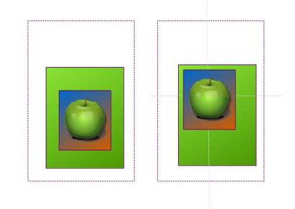

# Actor Tutorial

This tutorial describes the Dali Actor

In this tutorial the following subjects are covered:

[The Stage Actor](#1) 
[Adding an Actor to the Stage](#2) 
[Positioning Actors](#3) 
[Event Handling for Actors](#4) 

## Overview

An actor is the basic component that composes the entire scene. It can be visible ( UI components) or invisible (Layer).

An actor is also the primary object with which DALi applications interact.  Controls and Layers all derive from Actor.

Multiple types of event signals provided by actors can be handled in an application through user-defined callback functions.

## Adding an Actor to the Stage

Stage is a top-level object that represents the entire screen.
It is used for displaying a hierarchy of actors managed by the scene graph structure,
which means an actor inherits a position relative to its parent, and can be moved in relation to this point.

The stage instance is a singleton object (the only instance of its class during the lifetime of the program).

You can get it using a static function:

~~~{.cpp}
static Stage GetCurrent();
~~~

To display the contents of an actor, it must be added to a stage.
The following example shows how to connect a new actor to the stage:

~~~{.cpp}
Actor actor = Actor::New();
Stage::GetCurrent().Add( actor );
~~~

## Positioning Actors

By default an actor inherits its parent's position.
The relative position between the actor and parent is determined by the following properties ParentOrigin and
AnchorPoint.

In a 3D world, the Actor can be positioned in X,Y and Z axi. Although below only the X and Y is mentioned.

### AnchorPoint

This is the point on the Actor that its position refers to.  
Imagine its a pin or handle on the Actor that is used to position it.  
The default is center (Dali::AnchorPoint::CENTER)

Below the same ImageView (Apple) is parented to the large green rectangle.
The first example it has AnchorPoint::CENTER and the second is AnchorPoint::TOP_LEFT
The red dot indicates the anchor point.  The ParentOrigin in both is ParentOrigin::TOP_LEFT.

| AnchorPoint::CENTER | AnchorPoint::TOP_LEFT |
| --- | --- |
|  |  |
| ParentOrigin::TOP_LEFT | ParentOrigin::TOP_LEFT |

### ParentOrigin

This is reference point on the parent (which could be the stage) that the Actors position is set in relation to.
If CENTER then the Actors position will be X and Y from the center of the parent. Whilst if TOP_LEFT then the
Actors position will be X and Y from the top left.  Where X and Y is the displacement on each axis.

The default is top left (Dali::ParentOrigin::TOP_LEFT).

Below the same ImageView (Apple) is parented to the large green rectangle.
The first example it has ParentOrigin::CENTER and the second is ParentOrigin::TOP_LEFT
The red dot indicates the parent origin.  The AnchorPoint in both is AnchorPoint::TOP_LEFT.

| ParentOrigin::CENTER | ParentOrigin::TOP_LEFT |
| --- | --- |
|  |  |
| AnchorPoint::TOP_LEFT | AnchorPoint::TOP_LEFT |

### Position

The Actor can have its Position set.
Positions are Vectors and displace from the ParentOrigin. ( ParentOrigin to AnchorPoint).

### Position Inherritance

The Property::INHERIT_POSITION can be set to "false" which would mean the actor's position is set as a world position.
This is regardless of the ParentOrigin setting and the position of the parent.

Below the apple is parented to the green rectange with position ( 0, 0 ), it is positioned at the center of the parent.

The second image has

~~~{.cpp}
appleImageView.SetProperty(Actor::Property::INHERIT_POSITION, false );
~~~

Now the applie is still parented to the green rectange but positioned center to the stage (World Position (0,0) ).
The parent green rectangle can be repositioned without affecting the position of the child ( apple ).

## Event Handling for Actors

Dali::Actor provides the following signals

| Event Signal | Description
| ---| --- |
| TouchedSignal() | This signal is emitted when a touch input is received.
| HoveredSignal() | This signal is emitted when a hover input is received.
| WheelEventSignal() | This signal is emitted when a wheel event is received.
| OnStageSignal() | This signal is emitted after the actor has been connected to the stage.
| OffStageSignal() | This signal is emitted after the actor has been disconnected from the stage.
| OnRelayoutSignal() | This signal is emitted after the size has been set on the actor during relayout.

Below example shows the TouchedSignal being connected to.
The OnTouch callback is executed once the signal occurs ( The control is touched ).

~~~{.cpp}
void TouchedExample::Create( Application& application )
{
  // Control is one of the simplest types of Actor which is visible
  Control control = Control::New();
  control.SetSize( 100.0f, 100.0f );
  Stage::GetCurrent().Add( control );

  // Connect to a touch signal emitted by the control
  control.TouchedSignal().Connect( this, &TouchedExample::OnTouch );
}

bool TouchedExample::OnTouch( Actor actor, const TouchEvent& event )
{
  bool handled = false;
  unsigned int pointCount = event.GetPointCount();
  if( pointCount == 1 )
  {
    if( event.GetPoint( 0 ).state == TouchPoint::Down )
    {
      // Act on the first touch on screen
      handled = true;
    }
  }

  // true if you have handled the touch, false otherwise
  return handled;
}
~~~
