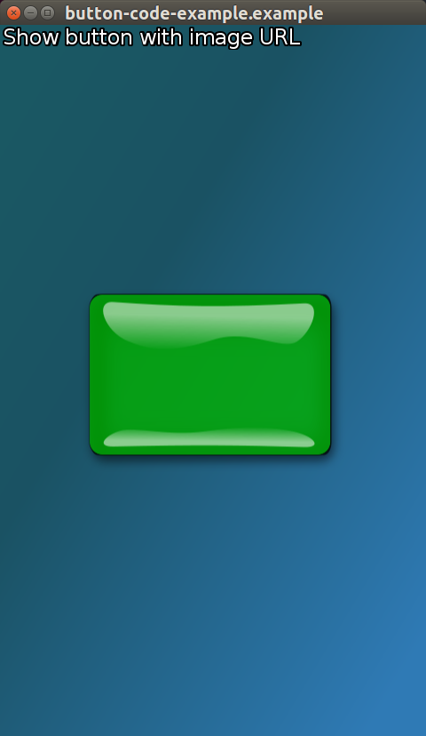
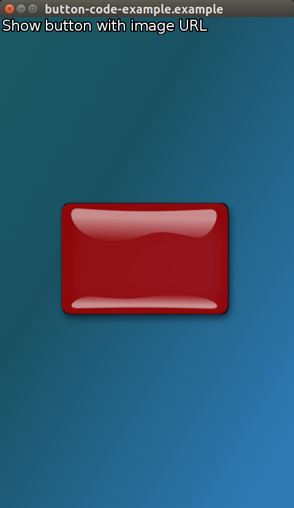
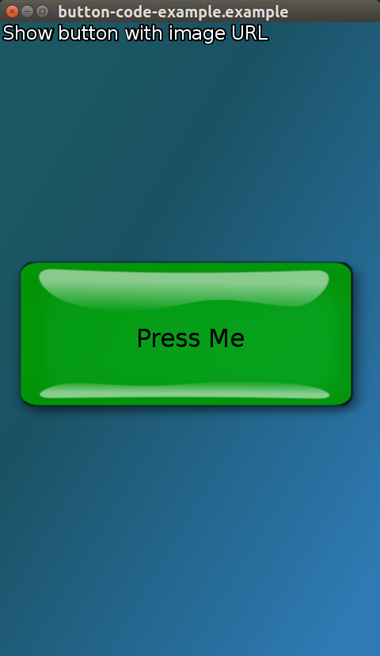
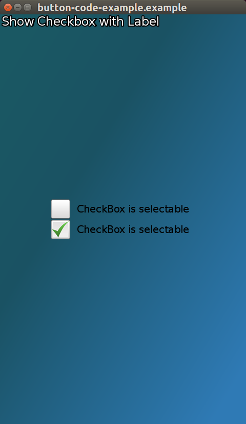
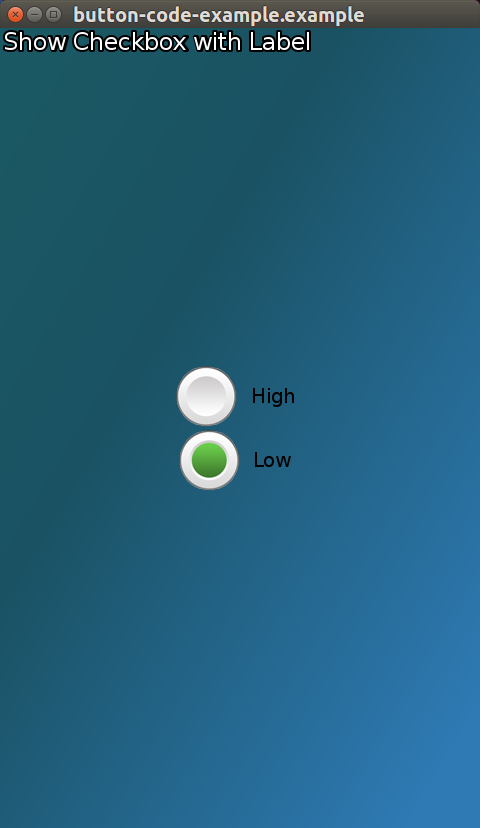

# Button Tutorial

This tutorial describes the button controls including, _PushButton_, _Checkbox_, _Radio_ and _Toggle_.

In this tutorial the following subjects are covered:

[Button creation with Visuals](#1) 
[Button events](#2) 

## Overview

The *Button* class is the base class for the button UI components.

Buttons can be  _disabled_.

Buttons can be made _togglable_. and then _selected_ or _unselected_

A *push button* changes its appearance when pressed, and returns to its original appearance when released.

The *check box* can be checked or unchecked.

The *radio button* has two states selected and unselected. Usually radio buttons are grouped, in a group only one
radio button can be selected at a given time.

The *toggle button* allows the user to switch a feature on or off. Toggle buttons also support tooltips.

### Button creation with Visuals

#### Using Visuals

Below Example of PushButton sets the SELECTED_BACKGROUND_VISUAL as "pressed-image-file.jpg"
and the UNSELECTED_BACKGROUND_VISUAL as "unselected-image-file.jpg"

Tizen 3.0 
UNSELECTED_BACKGROUND_VISUAL = Dali::Toolkit::Button::Property::UNSELECTED_STATE_IMAGE. 
SELECTED_BACKGROUND_VISUAL = Dali::Toolkit::Button::Property::SELECTED_STATE_IMAGE. 
DISABLED_UNSELECTED_BACKGROUND_VISUAL = Dali::Toolkit::Button::Property::DISABLED_STATE_IMAGE. 

Buttons can contain various Visuals not just ImageVisual.

Below is an example using [ImageVisual](#ButtonWithImageVisual), [TextVisual](#ButtonWithTextVisual) and [ColorVisual](#ButtonWithColorVisual)

##### Setting ImageVisual to a Button using a Property Map

Right button (Red) is when the button is selected.

Selected and unselected images are provided to the button as two property maps containing the required URL.

~~~{.cpp}
...
PushButton button = PushButton::New();

button.SetProperty( Button::Property::SELECTED_STATE_IMAGE,
                    Property::Map().Add( Visual::Property::TYPE,  Visual::IMAGE )
                    .Add( ImageVisual::Property::URL, DEMO_IMAGE_DIR "red-button.png" )
                    );

button.SetProperty( Button::Property::UNSELECTED_STATE_IMAGE,
                    Property::Map().Add( Visual::Property::TYPE,  Visual::IMAGE )
                    .Add( ImageVisual::Property::URL, DEMO_IMAGE_DIR "green-button.png" )
                    );

button.SetParentOrigin( ParentOrigin::CENTER );
mView.Add( button );  // Adding button to stage via mView which is a staged control.

~~~

#### Setting Text to a PushButton using a Property Map (Full Control)

~~~{.cpp}
Toolkit::PushButton button = Toolkit::PushButton::New();
Property::Map textSettingsMap;
              textSettingsMap.Add( Visual::Property::TYPE, Toolkit::Visual::TEXT )
                             .Add( TextVisual::Property::TEXT, "Press Me" )
                             .Add( TextVisual::Property::MULTI_LINE, true )
                             .Add( TextVisual::Property::POINT_SIZE, 12.0f );

button.SetProperty( Toolkit::Button::Property::LABEL, textSettingsMap );
~~~

#### Setting a ColorVisual to a PushButton using a Property Map

~~~{.cpp}
Toolkit::PushButton button = Toolkit::PushButton::New();
Property::Map visualSettingMap;
              visualSettingMap.Add( Visual::Property::TYPE, Toolkit::Visual::COLOR )
                              .Add( ColorVisual::Property::MIX_COLOR, Vector4( R, G, B, 1.0f ) );

button.SetProperty( DevelButton::Property::UNSELECTED_BACKGROUND_VISUAL, visualSettingMap );

OR

button.SetProperty( Toolkit::Button::Property::UNSELECTED_STATE_IMAGE, visualSettingMap );

~~~

#### Setting a ColorVisual for the background and a TextVisual for the Label.

Using the above ColorVisual and TextVisual to have a color background with text in the foreground.

~~~{.cpp}
Toolkit::PushButton button = Toolkit::PushButton::New();
Property::Map visualSettingMap;
              visualSettingMap.Add( Visual::Property::TYPE, Toolkit::Visual::COLOR )
                              .Add( ColorVisual::Property::MIX_COLOR, Vector4( R, G, B, 1.0f ) );

button.SetProperty( Toolkit::Button::Property::UNSELECTED_STATE_IMAGE, visualSettingMap );

Property::Map textSettingsMap;
              textSettingsMap.Add( Visual::Property::TYPE, Toolkit::Visual::TEXT )
                             .Add( TextVisual::Property::TEXT, "Press Me" )
                             .Add( TextVisual::Property::MULTI_LINE, true )
                             .Add( TextVisual::Property::POINT_SIZE, 12.0f );

button.SetProperty( Toolkit::Button::Property::LABEL, textSettingsMap );

~~~

#### Setting Text to a Button using a string (Basic)

~~~{.cpp}
Toolkit::PushButton button = Toolkit::PushButton::New();
button.SetProperty( Toolkit::Button::Property::LABEL, "Select" );
~~~

#### Check box button set up
Two checkboxes with default selected and unselected images.

~~~{.cpp}
Toolkit::CheckBoxButton checkboxButton1 = Toolkit::CheckBoxButton::New();
checkboxButton1.SetProperty( Toolkit::Button::Property::LABEL, "CheckBox is selectable" );
checkboxButton1.StateChangedSignal().Connect( this, &ButtonCode::CheckBoxSelected );
checkboxButton1.SetParentOrigin( ParentOrigin::CENTER );
checkboxButton1.SetAnchorPoint( AnchorPoint::BOTTOM_CENTER );
checkboxButton1.SetName("one");

Toolkit::CheckBoxButton checkboxButton2 = Toolkit::CheckBoxButton::New();
checkboxButton2.SetProperty( Toolkit::Button::Property::LABEL, "CheckBox is selectable" );
checkboxButton2.StateChangedSignal().Connect( this, &ButtonCode::CheckBoxSelected );
checkboxButton2.SetParentOrigin( ParentOrigin::CENTER );
checkboxButton2.SetAnchorPoint( AnchorPoint::TOP_CENTER );
checkboxButton2.SetName("two");

mView.Add( checkboxButton1 );
mView.Add( checkboxButton2 );
~~~

#### Radio buttons set up in a Group

Radio buttons parented to the same control only allow one to be selected at any time.

~~~{.cpp}
Control mView = Control::New();

Toolkit::RadioButton radioButton1 = Toolkit::RadioButton::New();
radioButton1.SetProperty( Toolkit::Button::Property::LABEL, "High" );
radioButton1.SetParentOrigin( ParentOrigin::CENTER );
radioButton1.SetAnchorPoint( AnchorPoint::BOTTOM_CENTER );
radioButton1.SetName("one");

Toolkit::RadioButton radioButton2 = Toolkit::RadioButton::New();
radioButton2.SetProperty( Toolkit::Button::Property::LABEL, "Low" );
radioButton2.SetParentOrigin( ParentOrigin::CENTER );
radioButton2.SetAnchorPoint( AnchorPoint::TOP_CENTER );
radioButton2.SetName("two");

mView.Add( radioButton1 );
mView.Add( radioButton2 );
~~~

#### Toggle button set up

~~~{.cpp}
ToggleButton toggleButton = ToggleButton::New();
~~~

[Back to top](#0)

### Button events

There are 4 events associated with the Button class:

+ Clicked	- The button is touched, and the touch point doesn't leave the boundary of the button.
+ Pressed	- The button is touched
+ Released	- The button is touched, and the touch point leaves the boundary of the button.
+ StateChanged	- The button's state is changed.

Here is an example of adding an event handler to a push button _Clicked_ event:

~~~{.cpp}
  button.ClickedSignal().Connect( this, &ButtonClicked );

  bool ChangeImageClicked( Button button )
  {
    ...
    // button pressed
    return true;
  }
~~~

Events are not fired when the disabled property is set to true.

The Button class provides the following properties which modify the fired events:

1. When *autorepeating* is set to true, the Pressed, Released and Clicked events are fired at regular
   intervals while the button is touched.

The interval times can be modified with the _InitialAutoRepeatingDelay_ and _NextAutoRepeatingDelay_ properties.

A togglable button can't be autorepeating. If the autorepeating property is set to true,
then the togglable property is set to false but no event is fired.

2. When *togglable* is set to true, a _StateChanged_ event is fired, with the selected state.

For a checkbox all 4 events are available, usually only the _StateChanged_ event is used to notify
when the button changes its state to selected or unselected.

For a radio button use the _StateChanged_ event to check when the radio button is selected.

[Back to top](#0)
