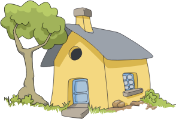

# Visuals

Visuals are the main building block for controls.

They are used to display (renderer) content.

Existing controls can be supplied with Visuals, the visuals are created with a Property Map and this map passed 
to the control.

The ImageView control is a good example of this.

The image can be set with a property map or an url.

~~~{.cpp}
auto imageView = ImageView:New();

imageView.SetProperty( ImageView::Property::IMAGE,
                       Property::Map().Add( ImageVisual::Property::URL, "./images/apple.svg" )
                                      .Add( ImageVisual::Property::ATLASING, false  ) );

~~~

or

~~~{.cpp}
auto imageView = ImageView:New();

imageView.SetProperty( ImageView::Property::IMAGE, "./images/apple.svg" );

~~~

Using the Property Map, further settings (Properties) can be applied to the Image (ImageVisual).

Visuals have common properties and specific ones.

In the second example with the url being passed in directly, the ImageView will internally create a Visual.

Currently the Visual avaiable are:

| Visual | Example | Visual | Example
| --- | ---
| Border |  | Color | 
| Gradient |  | Image |  
| SVG |  | NPatch | 
| Animated Image |  | Mesh | 
| Primitive |  | Text | 

WireFrame Visual - The wireframe visual is mainly used for debugging, replacing all other visuals when 'Visual Debug Rendering' is turned on.

### Visual Depth Index

The 'depth index' is the draw order for visuals within a control.

Depth index increases automatically for each added visual.

The last registered visual is always on top.

[Back to top](#top)

## Visuals and their Properties

If developing controls then read [Visual Creation and Registration](#visualcreation) before continuing.

### Color visual

Renders a color to the visual's quad geometry.

Visual.Type : **Color**

#### Usage

Creating a Map to pass to an existing control or to the Visual factory.
~~~{.cpp}
...

PropertyMap colorVisualMap;

colorVisualMap.Add( Visual::Property::TYPE,  Visual::Color ))
              .Add( ColorVisual::Property::MIX_COLOR, Color::RED );
~~~

If developing a control then that control would internally create the Visual and register it with the code below

~~~{.cpp}

private const int PROPERTY_REGISTRATION_START_INDEX = 10001000;
private const int ColorVisualPropertyIndex = PROPERTY_REGISTRATION_START_INDEX+1 ;

private VisualBase colorVisual;

colorVisual =  VisualFactory.Get().CreateVisual( colorVisual );
RegisterVisual( ColorVisualPropertyIndex, colorVisual );

~~~

#### Properties

| ColorVisualProperty | String   | Type    | Required | Description               |
|---------------------------------|---------|:--------:|:--------:|----------------|
|                     | MixColor | VECTOR4 | Yes      | The color required.       |

VisualMap  : **ColorVisual**

[Back to top](#top)

### Gradient Visual

Renders a smooth transition of colors to the visual's quad geometry.

Both Linear and Radial gradients are supported.

| Linear | Radial |
|--------|--------|
|  |  |

Visual.Type : **Gradient**

#### Usage - radial

~~~{.cpp}

...
...

Property::Map propertyMap;
propertyMap.Insert(Visual::Property::TYPE,  Visual::GRADIENT);
Vector2 start(-1.f, -1.f);
Vector2 end(1.f, 1.f);
propertyMap.Insert( GradientVisual::MIX_COLOR, Color::MAGENTA );
propertyMap.Insert( GradientVisual::Property::START_POSITION,   start) ;
propertyMap.Insert( GradientVisual::Property::END_POSITION,   end );
propertyMap.Insert( GradientVisual::Property::STOP_OFFSET,   Vector2(0.f, 1.f) );
propertyMap.Insert( GradientVisual::Property::SPREAD_METHOD, GradientVisual::SpreadMethod::REPEAT) ;
Property::Array stopColors;
stopColors.PushBack( Color::RED );
stopColors.PushBack( Color::GREEN );
propertyMap.Insert(GradientVisual::Property::STOP_COLOR,   stopColors);

~~~

### Properties

| GradientVisualProperty | Name          | Type              | Required |                        Description |
|------------------------|---------------|:-----------------:|:----------:|--------------------------------------------------------------------------------------|
|                        | StartPosition | VECTOR2           | For Linear | The start position of the linear gradient.                               |
|                        | EndPosition   | VECTOR2           | For Linear | The end position of the linear gradient.                                               |
|                        | Center        | VECTOR2           | For Radial | The center point of the gradient.                                                       |
|                        | Radius        | FLOAT             | For Radial | The size of the radius.                                                                 |
|                        | StopOffset    | ARRAY of FLOAT    | No         | All the stop offsets. If not supplied default is 0.0 and 1.0.                           |
|                        | StopColor     | ARRAY of VECTOR4  | Yes        | The color at those stop offsets. At least 2 required to show a gradient.                |
|                        | Units         | INTEGER or STRING | No         | Defines the coordinate system. [More info](#gradientunits)                                          |
|                        | SpreadMethod  | INTEGER or STRING | No         | Indicates what happens if gradient starts or ends inside bounds. [More info](#gradientspreadmethod) |

VisualMap : **GradientVisual**

#### Units

Defines the coordinate system for the attributes:
 + Start (x1, y1) and End (x2 and y2) points of a line if using a linear gradient.
 + Center point (cx, cy) and radius (r) of a circle if using a radial gradient.

#### Spread Method

Indicates what happens if the gradient starts or ends inside the bounds of the target rectangle.

| Enumeration | Name    | Description                                                                                          |
|------------------------------------------------------|---------|----------------------------------------------------------------------|
|             | Pad     | *Default*. Uses the terminal colors of the gradient to fill the remainder of the quad geometry.               |
|             | Reflect | Reflect the gradient pattern start-to-end, end-to-start, start-to-end etc. until the quad geometry is filled. |
|             | Repeat  | Repeat the gradient pattern start-to-end, start-to-end, start-to-end etc. until the quad geometry is filled.  |

[Back to top](#top)

### Image Visual

Renders an image into the visual's geometry.

The visual provided, depends on the extension of the image.

* Normal (Quad)
* N-Patch
* SVG
* Animated Image

Visual.Type : **Image**

### Normal

Renders a raster image ( jpg, png etc.) into the visual's quad geometry.

#### Usage

~~~{.cpp}
PropertyMap imageVisual;
imageVisual.Add( Visual::Property::TYPE,  Visual::Image )
           .Add( ImageVisualProperty.URL, new PropertyValue( _imageURL ));

~~~

#### Properties

| ImageVisualProperty | Name          | Type              | Required | Description
|---------------------------------------------------------|---------------|:-----------------:|:--------:|----------------------------------------------------|
|                     | URL           | STRING            | Yes      | The URL of the image.                                                                  |
|                     | FittingMode   | INTEGER or STRING | No       | Fitting options, used when resizing images to fit desired dimensions.|
|                     | samplingMode  | INTEGER or STRING | No       | Filtering options, used when resizing images to sample original pixels.  |
|                     | DesiredWidth  | INT               | No       | The desired image width. Will use actual image width if not specified.                 |
|                     | DesiredHeight | INT               | No       | The desired image height. Will use actual image height if not specified.               |
|                     | PixelArea     | VECTOR4           | No       | The image area to be displayed, default value is [0.0, 0.0, 1.0, 1.0]                  |
|                     | wrapModeU     | INTEGER or STRING | No       | Wrap mode for u coordinate |
|                     | wrapModeV     | INTEGER or STRING | No       | Wrap mode for v coordinate |

VisualMap : **ImageVisual**

### N-Patch

Renders an n-patch or a 9-patch image. Uses non-quad geometry. Both geometry and texture are cached to reduce memory consumption
if the same n-patch image is used elsewhere.

VisualMap : **NPatchVisual**

### SVG

Renders a svg image into the visual's quad geometry.

#### Features: SVG Tiny 1.2 specification

**supported:**

  * basic shapes
  * paths
  * solid color fill
  * gradient color fill
  * solid color stroke

**not supported:**

  * gradient color stroke
  * dash array stroke
  * view box
  * text
  * clip path

VisualMap : **SVGVisual**

### Animated Image Visual

Renders an animated image into the visual's quad geometry.

VisualMap : **AnimatedImageVisual**

[Back to top](#top)

### Border Visual

Renders a color as an internal border to the visual's geometry.

Visual.Type : **Border**

#### Usage

This example shows the use of a BorderVisual `VisualMap`:

~~~{.cpp}
...

Property::Map borderVisualMap;
borderVisualMap.Insert(Visual::Property::TYPE,  Visual::BORDER);
borderVisualMap.Insert("mixColor", Vector4(1.0f, 0.0f, 1.0f, 0.5f) );
borderVisualMap.Insert("borderColor",  Color::BLUE);
borderVisualMap.Insert("borderSize",  5.f);
borderVisualMap.Insert("antiAliasing",  true);

~~~

#### Properties

| BorderVisualProperty | String        | Type    | Required | Description                                      |
|------------------------------------------------------|---------------|:-------:|:--------:|------------------|
|                      | BorderColor   | VECTOR4 | Yes      | The color of the border.                         |
|                      | BorderSize    | FLOAT   | Yes      | The width of the border (in pixels).             |
|                      | AntiAliasing  | BOOLEAN | No       | Whether anti-aliasing of the border is required. |

VisualMap : **BorderVisual**

[Back to top](#top)

### Mesh Visual

Renders a mesh using an .obj file, optionally with textures provided by an `mtl` file. Scaled to fit the control.

Visual.Type : **Mesh**

#### Usage

~~~{.cpp}

Property::Map propertyMap;
propertyMap.Insert( Toolkit::Visual::Property::TYPE, Visual::MESH );
propertyMap.Insert( Visual::Property::MIX_COLOR, Color::BLUE );
propertyMap.Insert( MeshVisual::Property::OBJECT_URL, "/models/Dino.obj");
propertyMap.Insert( MeshVisual::Property::MATERIAL_URL, "/models/Dino.mtl"E );
propertyMap.Insert( MeshVisual::Property::TEXTURES_PATH, "/images/" );
propertyMap.Insert( MeshVisual::Property::SHADING_MODE, MeshVisual::ShadingMode::TEXTURELESS_WITH_DIFFUSE_LIGHTING );
propertyMap.Insert( MeshVisual::Property::LIGHT_POSITION, Vector3( 5.0f, 10.0f, 15.0f) );

~~~

#### Properties

| MeshVisualProperty | Name         | Type               | Required          | Description                                                                                      |
|--------------------|----------------|------------------|-----------------|-------------------------------------------------------------------|
|                    | ObjectURL      | STRING             | Yes               | The location of the ".obj" file.                                                                 |
|                    | MaterialURL    | STRING             | No                | The location of the ".mtl" file. Leave blank for a textureless object.                           |
|                    | TexturesPath   | STRING             | If using material | Path to the directory the textures (including gloss and normal) are stored in.                   |
|                    | ShadingMode    | INTEGER or STRING  | No                | Sets the type of shading mode that the mesh will use. [More info](#meshvisualshadingmode) |
|                    | UseMipmapping  | BOOLEAN            | No                | Flag for whether to use mipmaps for textures or not. Default true.                               |
|                    | UseSoftNormals | BOOLEAN            | No                | Flag for whether to average normals at each point to smooth textures or not. Default true.       |
|                    | LightPosition  | VECTOR3            | No                | The position, in stage space, of the point light that applies lighting to the model.             |

VisualMap : **MeshVisual**

#### Shading Mode

| Enumeration  | Name                                   | Description                                                                                                             |
|---------------------------------------------------------------------------------|------------------------------------------|----------------------------------------------------|
|              | TexturelessWithDefuseLighting          | *Simplest*. One color that is lit by ambient and diffuse lighting.                                                      |
|              | TexturedWithSpecularLighting           | Uses only the visual image textures provided with specular lighting in addition to ambient and diffuse lighting.        |
|              | TexturedWIthDetailedSpecularLIghting   | Uses all textures provided including a gloss, normal and texture map along with specular, ambient and diffuse lighting. |

[Back to top](#top)

### Primitive Visual

Renders a simple 3D shape, such as a cube or sphere. Scaled to fit the control.

The shapes are generated with clockwise winding and back-face culling on by default.

Visual.Type : **Primitive**

### Usage

Here is an example of using a Primitive visual, the actual shape is set via the `Shape` property.

~~~{.cpp}

        // Create Primitive Visual
        PropertyMap primitiveVisual;
        primitiveVisual.Add( Visual::Property::TYPE,  Visual::PRIMITIVE )
                       .Add( PrimitiveVisual::Property::SHAPE, PrimitiveVisual::Shape::CUBE )
                       .Add( PrimitiveVisual::Property::BEVEL_PERCENTAGE, 0.3f)
                       .Add( PrimitiveVisual::Property::BEVEL_SMOOTHNESS, 0.0f)
                       .Add( PrimitiveVisual::Property::SCALE_DIMENSIONS, Vector3( 1.0f,1.0f,0.3f ) )
                       .Add( PrimitiveVisual::Property::MIX_COLOR, Vector4((245.0f/255.0f), (188.0f/255.0f), (73.0f/255.0f), 1.0f));

~~~

#### Properties

| PrimitiveVisualProperty | Name              | Type               | Description                                                             |
|-------------------------|-------------------|------------------- |-------------------|
|                         | Shape             | INTEGER or STRING  | The specific shape to render.                                          |
|                         | mixColor          | VECTOR4            | The color of the shape.                                                |
|                         | Slices            | INTEGER            | The number of slices as you go around the shape. [More info](#slices)             |
|                         | Stacks            | INTEGER            | The number of stacks as you go down the shape. [More info](#stacks)   |
|                         | ScaleTopRadius    | FLOAT              | The scale of the radius of the top circle of a conical frustrum.                     |
|                         | ScaleBottomRadius | FLOAT              | The scale of the radius of the bottom circle of a conical frustrum.                  |
|                         | ScaleHeight       | FLOAT              | The scale of the height of a conic.                                                  |
|                         | ScaleRadius       | FLOAT              | The scale of the radius of a cylinder.                                               |
|                         | ScaleDimensions   | VECTOR3            | The dimensions of a cuboid. Scales in the same fashion as a 9-patch image.           |
|                         | BevelPercentage   | FLOAT              | Determines how bevelled the cuboid should be, based off the smallest dimenson [More info](#bevel)       |
|                         | BevelSmoothness   | FLOAT              | Defines how smooth the bevelled edges should be.                                      |
|                         | LightPosition     | VECTOR3            | The position, in stage space, of the point light that applies lighting to the model. |

VisualMap : **PrimitiveVisual**

#### Shapes

There are six shapes that can be chosen, some of which are simplified specialisations of another.

| Enumeration  | Name             | Description                                                                       |
|---------------------------------------------------------|------------------|----------------------------------------|
|              | Sphere           | *Default*.                                                                        |
|              | ConicalFrustrum  | The area bound between two circles, i.e. a cone with the tip removed.             |
|              | Cone             | Equivalent to a conical frustrum with top radius of zero.                         |
|              | Cylinder         | Equivalent to a conical frustrum with equal radii for the top and bottom circles. |
|              | Cube             | Equivalent to a bevelled cube with a bevel percentage of zero.                    |
|              | Octohedron       | Equivalent to a bevelled cube with a bevel percentage of one.                     |
|              | BevelledCube     | A cube/cuboid with all edges flattened to some degree.                            |

#### Examples below:

**sphere:**

**conics:**

| Frustrum | Cone | Cylinder |
|----------|------|----------|
|  |  |  |

#### Bevel

Bevel percentage ranges from 0.0 to 1.0. It affects the ratio of the outer face widths to the width of the overall cube, as shown:

| 0.0 ( cube) | 0.3 | 0.7 | 1.0 (octahedron) |
|-------------|-----|-----|------------------|
|  |  |  |  |

#### Slices

For spheres and conical frustrums, 'slices' determines how many divisions there are as you move around the object.

#### Stacks

For spheres, 'stacks' determines how many layers there are as you go down the object.

[Back to top](#top)

### Wireframe Visual

Renders a wireframe around a quad geometry.

The wireframe visual is mainly used for debugging, replacing all other visuals when 'Visual Debug Rendering' is turned on.

[Back to top](#top)

### Text Visual

Renders text within a control.

**Visual.Type** : "Text"

#### Usage

~~~{.cpp}
PropertyMap textVisualMap;
textVisualMap.Add(Visual::Property::TYPE,  Visual::TEXT )
             .Add(TextVisual::Property::TEXT, "hello world")
             .Add(TextVisual::Property::TEXT_COLOR, Color::WHITE)
             .Add(TextVisual::Property::POINT_SIZE, 7.0f)
             .Add(TextVisual::Property::HORIZONTAL_ALIGNMENT, HorizontalAlignment::CENTER))
             .Add(TextVisual::Property::VERTICAL_ALIGNMENT, VerticalAlignment::CENTER));

~~~

#### Properties

| TextVisualProperty  | Name                | Type          | Required | Description                                                                   |
|---------------------|---------------------|---------------|----------|-------------------------------------------------------------------------------|
|                     | Text                | STRING        | Yes      | The text to display in UTF-8 format                                           |
|                     | FontFamily          | STRING        | No       | The requested font family to use                                              |
|                     | FontStyle           | MAP           | No       | The requested font style to use                                               |
|                     | PointSize           | FLOAT         | Yes      | The size of font in points                                                    |
|                     | MultiLine           | BOOLEAN       | No       | The single-line or multi-line layout option                                   |
|                     | HorizontalAlignment | STRING        | No       | The line horizontal alignment: "BEGIN", "CENTER", "END"                       |
|                     | VerticalAlignment   | STRING        | No       | The line vertical alignment: "TOP",   "CENTER", "BOTTOM"                      |
|                     | TextColor           | VECTOR4       | No       | The color of the text                                                         |
|                     | EnableMarkup        | BOOL          | No       | If mark up should be enabled                                                  |

VisualMap : **TextVisual**

### Visual Creation and Registration

Visuals are created by supplying a property map to `factory` methods.

This returns a Visual Base object handle to the appropriately created visual.

Visuals need to be _registered_ to the parent control with a unique 'property' index.
Registering replaces the need to Add the visual.
The index is used for direct access to the visual within the control.
Registration also enables extra functionality,
such as connection to the _Stage_. `RegisterVisual` stores the visual 'handle' within the control.

This example demonstrates the recommended procedure for visual creation and registration, using 'explicit'
calls to the factory and register methods:

~~~{.cpp}
...
private const int PROPERTY_REGISTRATION_START_INDEX = 10001000;
private const int ColorVisualPropertyIndex = PROPERTY_REGISTRATION_START_INDEX+1 ;

colorVisual =  VisualFactory.Get().CreateVisual( colorVisualMap );

RegisterVisual( ColorVisualPropertyIndex, colorVisual );

~~~
