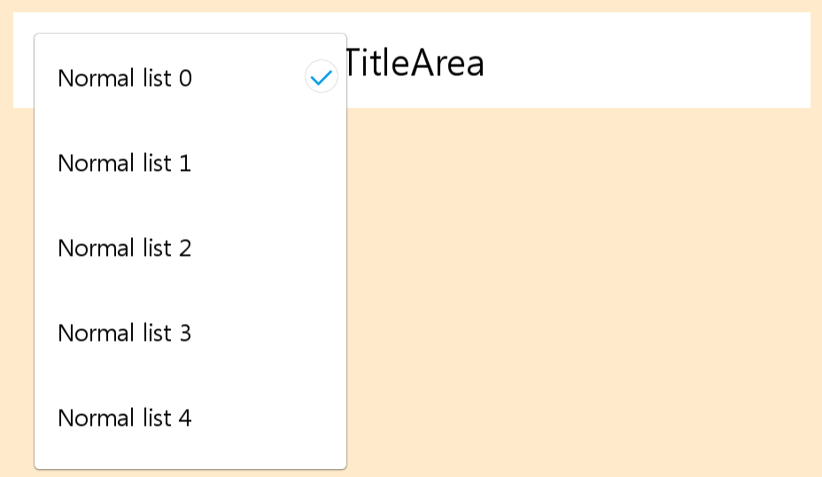

[HomePage](./Guide.md) 

# DropDown
This tutorial describes how to create and use DropDown.

## Overview
DropDown is one kind of common component, a dropdown allows the user click dropdown button to choose one value from a list.

## Create with property
1. Create DropDown by default constructor

~~~{.cs}
DropDown dropDown = new DropDown();
~~~

2. Set DropDown property

~~~{.cs}
dropDown = new DropDown();
dropDown.Size2D = new Size2D(900, 108);
dropDown.Position2D = new Position2D(50, 300);
dropDown.HeaderText = "TitleArea";
dropDown.HeaderTextColor = new Color(0, 0, 0, 1);
dropDown.HeaderTextPointSize = 28;
dropDown.HeaderTextFontFamily = "SamsungOneUI 500C";
dropDown.ButtonText = "DropDown Text";
dropDown.ButtonTextColor = new Color(0, 0, 0, 1);
dropDown.ButtonTextPointSize = 20;
dropDown.ButtonTextFontFamily = "SamsungOneUI 500";
dropDown.ButtonIconImageURL = "list_ic_dropdown.png";
dropDown.ButtonIconSize2D = new Size2D(48, 48);
dropDown.LeftSpace = 56;
dropDown.SpaceBetweenButtonTextAndIcon = 8;
dropDown.ListBackgroundImageURL = "dropdown_bg.png";
dropDown.ListBackgroundImageBorder = new Rectangle(51, 51, 51, 51);
dropDown.ListLeftMargin = 20;
dropDown.ListTopMargin = 20;
dropDown.BackgroundColor = new Color(1, 1, 1, 1);
dropDown.ListSize2D = new Size2D(360, 500);
dropDown.ListPadding = new Extents(4, 4, 4, 4);
root.Add(dropDown);
~~~

3. Create and add DropDownItemData

~~~{.cs}
for (int i = 0; i < 8; i++)
{
    DropDown.DropDownItemData item = new DropDown.DropDownItemData();
    item.Size2D = new Size2D(360, 96);
    item.BackgroundColorSelector = new ColorSelector
    {
        Pressed = new Color(0, 0, 0, 0.4f),
        Other = new Color(1, 1, 1, 0),
    };
    item.Text = "Normal list " + i;
    item.PointSize = 18;
    item.FontFamily = "SamsungOne 500";
    item.TextPosition2D = new Position2D(28, 0);
    item.CheckImageSize2D = new Size2D(40, 40);
    item.CheckImageResourceUrl = "dropdown_checkbox_on.png";
    item.CheckImageRightSpace = 16;
    dropDown.AddItem(item);
}

dropDown.SelectedItemIndex = 3;
~~~

DropDown created by property:

DropDown after click button:

DropDown after select dropdown item:

## Create with attributes
1. Create DropDown attributes

~~~{.cs}
DropDownAttributes attrs = new DropDownAttributes
{
    HeaderTextAttributes = new TextAttributes
    {
        Text = new StringSelector { All = "TitleArea" },
        PointSize = new FloatSelector { All = 28 },
        TextColor = new ColorSelector { All = new Color(0, 0, 0, 1) },
        FontFamily = "SamsungOneUI 500C",
        PositionUsesPivotPoint = true,
        ParentOrigin = Tizen.NUI.ParentOrigin.TopLeft,
        PivotPoint = Tizen.NUI.PivotPoint.TopLeft,
        WidthResizePolicy = ResizePolicyType.FillToParent,
        HeightResizePolicy = ResizePolicyType.FillToParent,
        HorizontalAlignment = HorizontalAlignment.Center,
        VerticalAlignment = VerticalAlignment.Center,
    },

    ButtonAttributes = new ButtonAttributes
    {
        TextAttributes = new TextAttributes
        {
            Text = new StringSelector { All = "DropDown Text" },
            PointSize = new FloatSelector { All = 20 },
            TextColor = new ColorSelector { All = new Color(0, 0, 0, 1) },
            FontFamily = "SamsungOneUI 500",
            PositionUsesPivotPoint = true,
            ParentOrigin = Tizen.NUI.ParentOrigin.TopLeft,
            PivotPoint = Tizen.NUI.PivotPoint.TopLeft,
            WidthResizePolicy = ResizePolicyType.UseNaturalSize,
            HeightResizePolicy = ResizePolicyType.FillToParent,
            Position2D = new Position2D(0, 0),
            HorizontalAlignment = HorizontalAlignment.Begin,
            VerticalAlignment = VerticalAlignment.Center,
        },
        IconAttributes = new ImageAttributes
        {
            Size2D = new Size2D(48, 48),
            ResourceURL = new StringSelector { All = "list_ic_dropdown.png" },
            PositionUsesPivotPoint = true,
            ParentOrigin = Tizen.NUI.ParentOrigin.CenterRight,
            PivotPoint = Tizen.NUI.PivotPoint.CenterRight,
        },
    },
    ListBackgroundImageAttributes = new ImageAttributes
    {
        ResourceURL = new StringSelector { All = "dropdown_bg.png" },
        Border = new RectangleSelector { All = new Rectangle(51, 51, 51, 51) },
        PositionUsesPivotPoint = true,
        ParentOrigin = Tizen.NUI.ParentOrigin.TopLeft,
        PivotPoint = Tizen.NUI.PivotPoint.TopLeft,
        WidthResizePolicy = ResizePolicyType.FitToChildren,
        HeightResizePolicy = ResizePolicyType.FitToChildren,
    },
    Space = new Vector4(56, 0, 0, 0),
    SpaceBetweenButtonTextAndIcon = 8,
    ListMargin = new Vector4(20, 0, 20, 0),
    BackgroundColor = new ColorSelector { All = new Color(1, 1, 1, 1) },
    ListSize2D = new Size2D(360, 500),
    ListPadding = new Extents(4, 4, 4, 4),               
};
~~~

2. Use the attributes to create DropDown and add to parent

~~~{.cs}
dropDown2 = new DropDown(attrs);
dropDown2.Size2D = new Size2D(900, 108);
dropDown2.Position2D = new Position2D(1000, 300);
root.Add(dropDown2);
~~~

3. Create and add DropDownItemData created by attributes

~~~{.cs}
DropDownItemAttributes itemAttrs = new DropDownItemAttributes
{
    BackgroundColor = new ColorSelector
    {
        Pressed = new Color(0, 0, 0, 0.4f),
        Other = new Color(1, 1, 1, 0),
    },
    TextAttributes = new TextAttributes
    {
        PointSize = new FloatSelector { All = 18 },
        FontFamily = "SamsungOne 500",
        Position2D = new Position2D(28, 0),
    },
    CheckImageAttributes = new ImageAttributes
    {
        Size2D = new Size2D(40, 40),
        ResourceURL = new StringSelector { All = "dropdown_checkbox_on.png" },
    },
    CheckImageRightSpace = 16,
};

for (int i = 0; i < 8; i++)
{
    DropDown.DropDownItemData item = new DropDown.DropDownItemData(itemAttrs);
    item.Size2D = new Size2D(360, 96);
    item.Text = "Normal list " + i;
    dropDown2.AddItem(item);
}
dropDown2.SelectedItemIndex = 0;
~~~

DropDown created by attributes:

DropDown after click button:

DropDown after select dropdown item:

## Create with defined styles
You can define a style according to the UX, then you can use the this style to ceate a dropdown.
1. User define a DropDown custom style as the whole view.

~~~{.cs}
internal class HeaderSpinnerDropDownStyle : StyleBase
{
    protected override Attributes GetAttributes()
    {
        DropDownAttributes attributes = new DropDownAttributes
        {
            HeaderTextAttributes = new TextAttributes
            {
                PointSize = new FloatSelector { All = 28 },
                TextColor = new ColorSelector { All = new Color(0, 0, 0, 1) },
                FontFamily = "SamsungOneUI 500C",
                PositionUsesPivotPoint = true,
                ParentOrigin = Tizen.NUI.ParentOrigin.TopLeft,
                PivotPoint = Tizen.NUI.PivotPoint.TopLeft,
                WidthResizePolicy = ResizePolicyType.FillToParent,
                HeightResizePolicy = ResizePolicyType.FillToParent,
                HorizontalAlignment = HorizontalAlignment.Center,
                VerticalAlignment = VerticalAlignment.Center,
            },

            ButtonAttributes = new ButtonAttributes
            {
                TextAttributes = new TextAttributes
                {
                    PointSize = new FloatSelector { All = 20 },
                    TextColor = new ColorSelector { All = new Color(0, 0, 0, 1) },
                    FontFamily = "SamsungOneUI 500",
                    PositionUsesPivotPoint = true,
                    ParentOrigin = Tizen.NUI.ParentOrigin.TopLeft,
                    PivotPoint = Tizen.NUI.PivotPoint.TopLeft,
                    WidthResizePolicy = ResizePolicyType.UseNaturalSize,
                    HeightResizePolicy = ResizePolicyType.FillToParent,
                    Position2D = new Position2D(0, 0),
                    HorizontalAlignment = HorizontalAlignment.Begin,
                    VerticalAlignment = VerticalAlignment.Center,
                },
                IconAttributes = new ImageAttributes
                {
                    Size2D = new Size2D(48, 48),
                    ResourceURL = new StringSelector { All = "list_ic_dropdown.png" },
                    PositionUsesPivotPoint = true,
                    ParentOrigin = Tizen.NUI.ParentOrigin.CenterRight,
                    PivotPoint = Tizen.NUI.PivotPoint.CenterRight,
                },
            },
            ListBackgroundImageAttributes = new ImageAttributes
            {
                ResourceURL = new StringSelector { All = "dropdown_bg.png" },
                Border = new RectangleSelector { All = new Rectangle(51, 51, 51, 51) },
                PositionUsesPivotPoint = true,
                ParentOrigin = Tizen.NUI.ParentOrigin.TopLeft,
                PivotPoint = Tizen.NUI.PivotPoint.TopLeft,
                WidthResizePolicy = ResizePolicyType.FitToChildren,
                HeightResizePolicy = ResizePolicyType.FitToChildren,
            },
            Space = new Vector4(56, 0, 0, 0),
            SpaceBetweenButtonTextAndIcon = 8,
            ListMargin = new Vector4(20, 0, 20, 0),
            BackgroundColor = new ColorSelector { All = new Color(1, 1, 1, 1) },
            ListPadding = new Extents(4, 4, 4, 4),
        };
        return attributes;
    }
}
~~~

2. User define a DropDownItemData custom style as the whole view.

~~~{.cs}
internal class TextListItemStyle : StyleBase
{
    protected override Attributes GetAttributes()
    {
        DropDownItemAttributes attributes = new DropDownItemAttributes
        {
            BackgroundColor = new ColorSelector
            {
                Pressed = new Color(0, 0, 0, 0.4f),
                Other = new Color(1, 1, 1, 0),
            },
            TextAttributes = new TextAttributes
            {
                PointSize = new FloatSelector { All = 18 },
                FontFamily = "SamsungOne 500",
                Position2D = new Position2D(28, 0),
            },
            CheckImageAttributes = new ImageAttributes
            {
                Size2D = new Size2D(40, 40),
                ResourceURL = new StringSelector { All = "dropdown_checkbox_on.png" },
            },
            CheckImageRightSpace = 16,
        };

        return attributes;
    }
}
~~~

3. Register your custom DropDown and DropDownItemData style.

~~~{.cs}
StyleManager.Instance.RegisterStyle("HeaderDropDown", null, typeof(HeaderSpinnerDropDownStyle));
StyleManager.Instance.RegisterStyle("TextListItem", null, typeof(TextListItemStyle));
~~~

4. Use your custom style to create a DropDown instance

~~~{.cs}
dropDown = new Tizen.NUI.CommonUI.DropDown("HeaderDropDown");
dropDown.Size2D = new Size2D(1080, 108);
dropDown.Position2D = new Position2D(0, 100);
dropDown.ListSize2D = new Size2D(360, 500);
dropDown.HeaderText = "Header area";
dropDown.ButtonText = "Normal list 1";
root.Add(dropDown);
~~~

5. Create and add DropDownItemData created by defined styles

~~~{.cs}
for (int i = 0; i < 8; i++)
{
    Tizen.NUI.CommonUI.DropDown.DropDownItemData item = new Tizen.NUI.CommonUI.DropDown.DropDownItemData("TextListItem");
    item.Size2D = new Size2D(360, 96);
    item.Text = "Normal list " + i;
    dropDown.AddItem(item);
}
~~~

DropDown created by style:

DropDown after click button:

DropDown after select dropdown item:

## Attach ScrollBar
~~~{.cs}
scrollBar = new ScrollBar();
scrollBar.Direction = ScrollBar.DirectionType.Vertical;
scrollBar.Position2D = new Position2D(394, 2);
scrollBar.Size2D = new Size2D(4, 446);
scrollBar.TrackColor = Color.Green;
scrollBar.ThumbSize = new Size2D(4, 30);
scrollBar.ThumbColor = Color.Yellow;
scrollBar.TrackImageURL = "c_progressbar_white_buffering.png";
dropDown.AttachScrollBar(scrollBar);
~~~

## Responding to ItemClickEvent
When user click a DropDownItemData, the DropDown instance receives a item click event.
You can declare the ItemClick event handler as following:

~~~{.cs}
dropDown = new Tizen.NUI.CommonUI.DropDown("HeaderDropDown");
dropDown.ItemClickEvent += DropDownItemClickEvent;
private void DropDownItemClickEvent(object sender, DropDown.ItemClickEventArgs e)
{
    // Do something in response to dropdown item click
}
~~~
