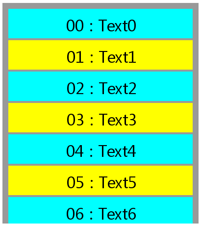
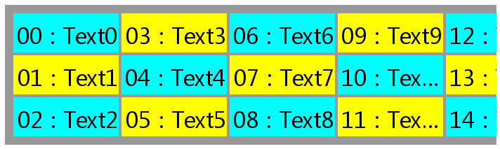

[HomePage](./Guide.md) 

# FlexibleView
This tutorial describes how to use FlexibleView to create a grid and list.

## Overview
A flexible view for providing a limited window into a large data set.

## Use felxibleView to create a list
Here is a sample about use flexibleView to show a list of text.

1. Firstly, define the source data of the list.
~~~{.cs}
public class ListItemData
{
    private string str;

    public ListItemData(int i)
    {
        str = "Text" + i.ToString();
    }

    public string TextString
    {
        get
        {
            return str;
        }
    }
}
~~~

2. Define the item view.
~~~{.cs}
public class ListItemView : View
{
    private TextLabel mText;

    public ListItemView()
    {
        mText = new TextLabel();
        mText.WidthResizePolicy = ResizePolicyType.FillToParent;
        mText.HeightResizePolicy = ResizePolicyType.FillToParent;
        mText.PointSize = 22;
        mText.HorizontalAlignment = HorizontalAlignment.Center;
        mText.VerticalAlignment = VerticalAlignment.Center;
        Add(mText);
    }

    public string MainText
    {
        get
        {
            return mText.Text;
        }
        set
        {
            mText.Text = value;
        }
    }
}
~~~

3. Define the adapter. it responsibles for providing views that represent items in a data set.
~~~{.cs}
public class ListBridge : FlexibleView.Adapter
{
    private List<ListItemData> mDatas;

    public ListBridge(List<ListItemData> datas)
    {
        mDatas = datas;
    }

    public override FlexibleView.ViewHolder OnCreateViewHolder(int viewType)
    {
        FlexibleView.ViewHolder viewHolder = new FlexibleView.ViewHolder(new ListItemView());

        return viewHolder;
    }

    public override void OnBindViewHolder(FlexibleView.ViewHolder holder, int position)
    {
        ListItemData listItemData = mDatas[position];

        ListItemView listItemView = holder.ItemView as ListItemView;
        listItemView.Name = "Item" + position;
        listItemView.SizeWidth = 150;
        listItemView.SizeHeight = 60;
        if (listItemView != null)
        {
            listItemView.MainText = String.Format("{0:D2}", position) + " : " + listItemData.TextString;
        }
        listItemView.Margin = new Extents(2, 2, 2, 2);
        if (position % 2 == 0)
            listItemView.BackgroundColor = Color.Cyan;
        else
            listItemView.BackgroundColor = Color.Yellow;
    }

    public override void OnDestroyViewHolder(FlexibleView.ViewHolder holder)
    {
        if (holder.ItemView != null)
        {
            holder.ItemView.Dispose();
        }
    }

    public override int GetItemCount()
    {
        return mDatas.Count;
    }

    public override void OnFocusChange(FlexibleView flexibleView, int previousFocus, int currentFocus)
    {
        FlexibleView.ViewHolder previousFocusView = flexibleView.FindViewHolderForAdapterPosition(previousFocus);
        if (previousFocusView != null)
        {
            if (previousFocusView.AdapterPosition % 2 == 0)
                previousFocusView.ItemView.BackgroundColor = Color.Cyan;
            else
                previousFocusView.ItemView.BackgroundColor = Color.Yellow;
        }
        FlexibleView.ViewHolder currentFocusView = flexibleView.FindViewHolderForAdapterPosition(currentFocus);
        if (currentFocusView != null)
        {
            currentFocusView.ItemView.BackgroundColor = Color.Magenta;
        }
    }

    public override void OnViewAttachedToWindow(FlexibleView.ViewHolder holder)
    {
    }

    public override void OnViewDetachedFromWindow(FlexibleView.ViewHolder holder)
    {
    }

}
~~~

4. Create the flexibleView and add it to window
To make a list, here we create a LinearLayoutManager instance as the layout manager of the flexibleView.
~~~{.cs}
flexibleView = new FlexibleView();
flexibleView.Name = "RecyclerView";
flexibleView.Position2D = new Position2D(500, 200);
flexibleView.Size2D = new Size2D(400, 450);
flexibleView.Padding = new Extents(10, 10, 10, 10);
flexibleView.BackgroundColor = new Color(0.0f, 0.0f, 0.0f, 0.4f);
flexibleView.FocusedItemIndex = 0;
flexibleView.Focusable = true;

List<ListItemData> dataList = new List<ListItemData>();
for (int i = 0; i < 131; ++i)
{
    dataList.Add(new ListItemData(i));
}
adapter = new ListBridge(dataList);
flexibleView.SetAdapter(adapter);

LinearLayoutManager layoutManager = new LinearLayoutManager(LinearLayoutManager.VERTICAL);
flexibleView.SetLayoutManager(layoutManager);
window.Add(flexibleView);
~~~

You can create a scrollbar and attach it to flexibleView.
~~~{.cs}
scrollBar = new ScrollBar();
scrollBar.Direction = ScrollBar.DirectionType.Vertical;
scrollBar.Position2D = new Position2D(394, 2);
scrollBar.Size2D = new Size2D(4, 446);
scrollBar.TrackColor = Color.Green;
scrollBar.ThumbSize = new Size2D(4, 30);
scrollBar.ThumbColor = Color.Yellow;
scrollBar.TrackImageURL = CommonResource.GetResourcePath() + "component/c_progressbar/c_progressbar_white_buffering.png";
flexibleView.AttachScrollBar(scrollBar);
~~~

## Use felxibleView to create a grid
CommonUI provides GridLayoutManager for user to create a grid. We use the source data, itemview and adapter to create a grid.
~~~{.cs}
flexibleView = new FlexibleView();
flexibleView.Name = "RecyclerView";
flexibleView.Position2D = new Position2D(500, 800);
flexibleView.Size2D = new Size2D(700, 200);
flexibleView.Padding = new Extents(10, 10, 10, 10);
flexibleView.BackgroundColor = new Color(0.0f, 0.0f, 0.0f, 0.4f);
flexibleView.FocusedItemIndex = 0;
flexibleView.Focusable = true;
flexibleView.SetAdapter(adapter);
window.Add(flexibleView);

GridLayoutManager layoutManager = new GridLayoutManager(3, LinearLayoutManager.HORIZONTAL);
flexibleView.SetLayoutManager(layoutManager);

scrollBar = new ScrollBar();
scrollBar.Position2D = new Position2D(2, 194);
scrollBar.Size2D = new Size2D(696, 4);
scrollBar.TrackColor = Color.Green;
scrollBar.ThumbSize = new Size2D(30, 4);
scrollBar.ThumbColor = Color.Yellow;
scrollBar.TrackImageURL = CommonResource.GetResourcePath() + "component/c_progressbar/c_progressbar_white_buffering.png";
flexibleView.AttachScrollBar(scrollBar);
~~~

