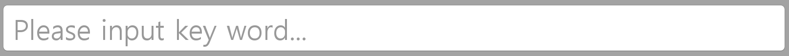
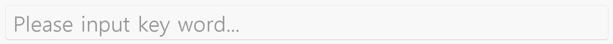

[HomePage](./Guide.md) 

# InputField
This tutorial describes how to create and use input field.

## Overview
InputField is a kind of common component and it is used when users are required to input characters or numbers.

- Use a text field when users need to enter characters or characters and numbers at the same time.
- Use hint text when it’s necessary to provide users with more information about what they have to enter.
- Hint text can be a guide message or the latest value that a user typed into the text field.

## Create with property
1. Create InputField by default constructor

~~~{.cs}
utilityBasicInputField = new InputField();
~~~

2. Set button property

~~~{.cs}
utilityBasicInputField.Space = 24;
utilityBasicInputField.BackgroundImageURL = "Action bar/search_bg.png";
utilityBasicInputField.BackgroundImageBorder = new Rectangle(45, 45, 0, 0);
utilityBasicInputField.TextColor = new Color(0, 0, 0, 1);
utilityBasicInputField.HintTextColor = new Color(0, 0, 0, 0.4f);
utilityBasicInputField.FontFamily = "SamsungOne 500";
utilityBasicInputField.PointSize = 38;
utilityBasicInputField.CursorWidth = 2;
~~~

InputField created by property:

## Create with attributes
1. Create button attributes

~~~{.cs}
InputFieldAttributes inputFieldAttributes = new InputFieldAttributes
{
    Space = 24,
    BackgroundImageAttributes = new ImageAttributes
    {
        ResourceURL = new StringSelector { All = "Action bar/search_bg.png" },
        Border = new RectangleSelector { All = new Rectangle(45, 45, 0, 0) }
    },
    InputBoxAttributes = new TextFieldAttributes
    {
        TextColor = new ColorSelector
        {
            Normal = new Color(0, 0, 0, 1),
            Pressed = new Color(0, 0, 0, 1),
            Disabled = new Color(0, 0, 0, 0.4f)
        },
        PlaceholderTextColor = new ColorSelector
        {
            All = new Color(0, 0, 0, 0.4f)
        },
        HorizontalAlignment =  HorizontalAlignment.Begin,
        VerticalAlignment =  VerticalAlignment.Center,
        FontFamily = "SamsungOne 500",
        PointSize = new FloatSelector
        {
            All = 38
        },
        CursorWidth = 2,
    },
};
~~~

2. Use the attributes to create a input field and add it to parent

~~~{.cs}
utilityBasicInputField = new InputField(inputFieldAttributes);
utilityBasicInputField.Size2D = new Size2D(1600, 95);
utilityBasicInputField.Position2D = new Position2D(100, 300);
root.Add(utilityBasicInputField);
~~~

InputField created by attributes:

## Create with defined styles
You can define a style according to the UX, then you can use the this style to ceate a input field.

1. User define a custom style as the whole view.

~~~{.cs}
internal class CustomInputFieldStyle : StyleBase
{
    protected override Attributes GetAttributes()
    {
        InputFieldAttributes attributes = new InputFieldAttributes
        {
            Space = 24,
            SpaceBetweenTextFieldAndRightButton = 56,
            BackgroundImageAttributes = new ImageAttributes
            {
                ResourceURL = new StringSelector
                {
                    All = "search_bg.png",
                },
                Border = new RectangleSelector
                {
                    All = new Rectangle(45, 45, 0, 0),
                },
            },
            InputBoxAttributes = new TextFieldAttributes
            {
                TextColor = new ColorSelector
                {
                    Normal = new Color(0, 0, 0, 1),
                    Pressed = new Color(0, 0, 0, 1),
                    Disabled = new Color(0, 0, 0, 0.4f)
                },
                PlaceholderTextColor = new ColorSelector
                {
                    All = new Color(0, 0, 0, 0.4f),
                },
                PrimaryCursorColor = new ColorSelector
                {
                    All = Utility.Hex2Color(0x0aaaf5, 1),
                },
                SecondaryCursorColor = new ColorSelector
                {
                    All = Utility.Hex2Color(0x0aaaf5, 1),
                },
                HorizontalAlignment = HorizontalAlignment.Begin,
                VerticalAlignment = VerticalAlignment.Center,
                PointSize = new FloatSelector
                {
                    All = 38,
                },
                FontFamily = "SamsungOne 500",
                CursorWidth = 2,
            },
            CancelButtonAttributes = new ImageAttributes
            {
                Size2D = new Size2D(56, 56),
                ResourceURL = new StringSelector
                {
                    All = "field_ic_cancel_24c447.png",
                }
            },
        };

        return attributes;
    }
}
~~~

2. Register your custom style.

~~~{.cs}
StyleManager.Instance.RegisterStyle("CustomInputField", null, typeof(YourNameSpace.CustomInputFieldStyle));
~~~

3. Use your custom style to create a button instance

~~~{.cs}
utilityBasicInputField = new InputField("CustomInputField");
utilityBasicInputField.Size2D = new Size2D(1600, 95);
utilityBasicInputField.Position2D = new Position2D(100, 300);
root.Add(utilityBasicInputField);
~~~
