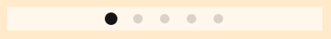

[HomePage](./Guide.md) 

# Pagination
Pagination shows the number of pages available and the currently active page. This appears as series of small dots.

## Overview

## Create with properties

~~~{.cs}
pagination = new Pagination();
pagination.Name = "Pagination";
pagination.Position2D = new Position2D(500, 450);
pagination.Size2D = new Size2D(400, 30);
pagination.BackgroundColor = new Color(1.0f, 1.0f, 1.0f, 0.6f);
pagination.IndicatorSize = new Size2D(26, 26);
pagination.IndicatorBackgroundURL = CommonResource.GetResourcePath() + "9. Controller/pagination_ic_nor.png";
pagination.IndicatorSelectURL = CommonResource.GetResourcePath() + "9. Controller/pagination_ic_sel.png";
pagination.IndicatorSpacing = 8;
pagination.IndicatorCount = PAGE_COUNT;
pagination.SelectedIndex = 0;
window.Add(pagination);
~~~

## Create with custom attributes
1. Firstly, we create a pagination attributes as the whole view to set the properties of the indicator.

~~~{.cs}
PaginationAttributes attrs = new PaginationAttributes()
{
    IndicatorSize = new Size2D(26, 26),
    IndicatorBackgroundURL = CommonResource.GetResourcePath() + "9. Controller/pagination_ic_nor.png",
    IndicatorSelectURL = CommonResource.GetResourcePath() + "9. Controller/pagination_ic_sel.png",
    IndicatorSpacing = 8,
};
~~~

2. Use the attributes to create a pagination and add it to its parent.

~~~{.cs}
pagination = new Pagination(attrs);
pagination.Name = "Pagination";
pagination.Position2D = new Position2D(500, 500);
pagination.Size2D = new Size2D(400, 30);
pagination.BackgroundColor = new Color(1.0f, 1.0f, 1.0f, 0.6f);
pagination.IndicatorCount = PAGE_COUNT;
pagination.SelectedIndex = 0;
window.Add(pagination);
~~~

## Create with defined styles
You can define a style according to the UX, then you can use the this style to ceate a pagination.

1. Firstly, we define a custome style as the whole view.
~~~{.cs}
internal class CustomePaginationStyle : StyleBase
{
    protected override Attributes GetAttributes()
    {
        if (Content != null)
        {
            return (Content as Attributes).Clone();
        }
        PaginationAttributes attributes = new PaginationAttributes
        {
            IndicatorSize = new Size2D(26, 26),
            IndicatorBackgroundURL = CommonResource.GetResourcePath() + "9. Controller/pagination_ic_nor.png",
            IndicatorSelectURL = CommonResource.GetResourcePath() + "9. Controller/pagination_ic_sel.png",
            IndicatorSpacing = 8,
        };
        return attributes;
    }
}
~~~

2. Register your custome style.

~~~{.cs}
CommonUI.StyleManager.Instance.RegisterStyle("CustomePagination", null, typeof(CustomePaginationStyle));
~~~

3. Use your custome style to create a scroll bar instance
~~~{.cs}
pagination = new Pagination("CustomePagination");
pagination.Position2D = new Position2D(500, 300);
pagination.Size2D = new Size2D(400, 30);
pagination.BackgroundColor = new Color(1.0f, 1.0f, 1.0f, 0.6f);
pagination.IndicatorCount = PAGE_COUNT;
pagination.SelectedIndex = 0;
window.Add(pagination);
~~~

## Pagination Properties

The properties available in the *Pagination* class are:

| Property  | Type | Description
| ------------ | ------------ | ------------ |
| IndicatorSize | Size2D | Gets or sets the size of the indicator |
| IndicatorBackgroundURL | string | Gets or sets the background resource of indicator |
| IndicatorSelectURL | string | Gets or sets the resource of the select indicator |
| IndicatorSpacing | int | Gets or sets the space of the indicator |
| IndicatorCount | int | Gets or sets the count of the pages/indicators |
| SelectedIndex | int | Gets or sets the index of the select indicator |

