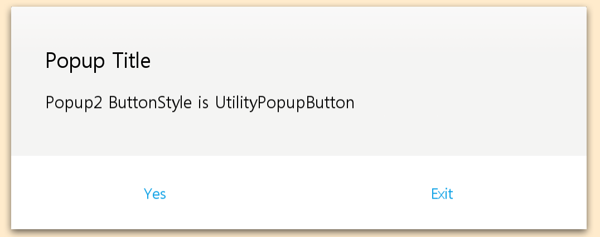

[HomePage](./Guide.md) 

# Popup
This tutorial describes how to create and use Popup.

## Overview
Popup is one kind of common component, it can be used as popup window.
User can handle Popup button count, head title and content area.

## Create with property
1. Create Popup by default constructor

~~~{.cs}
Popup popup = new Popup();
~~~

2. Set popup property

~~~{.cs}
//set Popup property
popup.MinimumSize = new Size2D(1032, 184);
popup.Size2D = new Size2D(1032, 400);
popup.Position2D = new Position2D(200, 100);
popup.ShadowImageURL = "popup_background_shadow.png";
popup.ShadowImageBorder = new Rectangle(0, 0, 105, 105);
popup.ShadowOffset = new Vector4(24, 24, 24, 24);
popup.BackgroundImageURL = "popup_background.png";
popup.BackgroundImageBorder = new Rectangle(0, 0, 81, 81);

//set Popup title property
popup.TitlePointSize = 25;
popup.TitleTextColor = Color.Black;
popup.TitleHeight = 68;
popup.TitleTextHorizontalAlignment = HorizontalAlignment.Begin;
popup.TitleTextPosition2D = new Position2D(64, 52);
popup.TitleText = "Popup Title";

//set Popup button property
popup.ButtonBackgroundImageURL = "rectangle_btn_normal.png";
popup.ButtonBackgroundImageBorder = new Rectangle(5, 5, 5, 5);
popup.ButtonOverLayBackgroundColorSelector = new ColorSelector
{
    Normal = new Color(1.0f, 1.0f, 1.0f, 1.0f),
    Pressed = new Color(0.0f, 0.0f, 0.0f, 0.1f),
    Selected = new Color(1.0f, 1.0f, 1.0f, 1.0f),
};
popup.ButtonTextColor = color[index];
popup.ButtonHeight = 132;
popup.ButtonCount = 2;
popup.SetButtonText(0, "Yes");
popup.SetButtonText(1, "Exit");
root.Add(popup);
~~~

Popup created by property:

## Create with attributes
1. Create popup attributes

~~~{.cs}
PopupAttributes attrs = new PopupAttributes
{
    MinimumSize = new Size2D(1032, 184),
    ShadowOffset = new Vector4(24, 24, 24, 24),
    TitleTextAttributes = new TextAttributes
    {
        PointSize = new FloatSelector { All = 25 },
        TextColor = new ColorSelector { All = Color.Black },
        Size2D = new Size2D(0, 68),
        PositionUsesPivotPoint = true,
        ParentOrigin = Tizen.NUI.ParentOrigin.TopLeft,
        PivotPoint = Tizen.NUI.PivotPoint.TopLeft,
        HorizontalAlignment = HorizontalAlignment.Begin,
        VerticalAlignment = VerticalAlignment.Bottom,
        Position2D = new Position2D(64, 52),
        Text = new StringSelector { All = "Popup Title" },
    },
    ShadowImageAttributes = new ImageAttributes
    {
        PositionUsesPivotPoint = true,
        ParentOrigin = Tizen.NUI.ParentOrigin.Center,
        PivotPoint = Tizen.NUI.PivotPoint.Center,
        ResourceURL = new StringSelector { All = "popup_background_shadow.png" },
        Border = new RectangleSelector { All = new Rectangle(0, 0, 105, 105) },
    },
    BackgroundImageAttributes = new ImageAttributes
    {
        PositionUsesPivotPoint = true,
        ParentOrigin = Tizen.NUI.ParentOrigin.Center,
        PivotPoint = Tizen.NUI.PivotPoint.Center,
        WidthResizePolicy = ResizePolicyType.FillToParent,
        HeightResizePolicy = ResizePolicyType.FillToParent,
        ResourceURL = new StringSelector { All = "popup_background.png" },
        Border = new RectangleSelector { All = new Rectangle(0, 0, 81, 81) },
    },
    ButtonAttributes = new ButtonAttributes
    {
        Size2D = new Size2D(0, 132),
        PositionUsesPivotPoint = true,
        ParentOrigin = Tizen.NUI.ParentOrigin.BottomLeft,
        PivotPoint = Tizen.NUI.PivotPoint.BottomLeft,
        BackgroundImageAttributes = new ImageAttributes
        {
            PositionUsesPivotPoint = true,
            ParentOrigin = Tizen.NUI.ParentOrigin.Center,
            PivotPoint = Tizen.NUI.PivotPoint.Center,
            WidthResizePolicy = ResizePolicyType.FillToParent,
            HeightResizePolicy = ResizePolicyType.FillToParent,
            ResourceURL = new StringSelector { All = "rectangle_btn_normal.png" },
            Border = new RectangleSelector { All = new Rectangle(5, 5, 5, 5) },
        },
        OverlayImageAttributes = new ImageAttributes
        {
            PositionUsesPivotPoint = true,
            ParentOrigin = Tizen.NUI.ParentOrigin.Center,
            PivotPoint = Tizen.NUI.PivotPoint.Center,
            WidthResizePolicy = ResizePolicyType.FillToParent,
            HeightResizePolicy = ResizePolicyType.FillToParent,
            BackgroundColor = new ColorSelector
            {
                Normal = new Color(1.0f, 1.0f, 1.0f, 1.0f),
                Pressed = new Color(0.0f, 0.0f, 0.0f, 0.1f),
                Selected = new Color(1.0f, 1.0f, 1.0f, 1.0f),
            },
        },
        TextAttributes = new TextAttributes
        {
            PositionUsesPivotPoint = true,
            ParentOrigin = Tizen.NUI.ParentOrigin.Center,
            PivotPoint = Tizen.NUI.PivotPoint.Center,
            HorizontalAlignment = HorizontalAlignment.Center,
            VerticalAlignment = VerticalAlignment.Center,
            TextColor = new ColorSelector { All = color[index2] },
        },
    },
};
~~~

2. Use the attributes to create a popup and add popup to parent

~~~{.cs}
popup2 = new Popup(attrs);
popup2.Size2D = new Size2D(1032, 400);
popup2.Position2D = new Position2D(200, 600);
popup2.ButtonCount = 2;
popup2.SetButtonText(0, "Yes");
popup2.SetButtonText(1, "Exit");
root.Add(popup2);
~~~

Popup created by attributes:

## Create with defined styles
You can define a style according to the UX, then you can use the this style to ceate a popup.

1. User define a custom style as the whole view.

~~~{.cs}
internal class CustomPopupStyle : StyleBase
{
    protected override Attributes GetAttributes()
    {
        PopupAttributes attributes = new PopupAttributes
        {
            MinimumSize = new Size2D(1032, 184),
            ShadowOffset = new Vector4(24, 24, 24, 24),
            TitleTextAttributes = new TextAttributes
            {
                PointSize = new FloatSelector { All = 25 },
                TextColor = new ColorSelector { All = Color.Black },
                Size2D = new Size2D(0, 68),
                PositionUsesPivotPoint = true,
                ParentOrigin = Tizen.NUI.ParentOrigin.TopLeft,
                PivotPoint = Tizen.NUI.PivotPoint.TopLeft,
                HorizontalAlignment = HorizontalAlignment.Begin,
                VerticalAlignment = VerticalAlignment.Bottom,
                Position2D = new Position2D(64, 52),
            },
            ShadowImageAttributes = new ImageAttributes
            {
                PositionUsesPivotPoint = true,
                ParentOrigin = Tizen.NUI.ParentOrigin.Center,
                PivotPoint = Tizen.NUI.PivotPoint.Center,
                ResourceURL = new StringSelector { "popup_background_shadow.png" },
                Border = new RectangleSelector { All = new Rectangle(0, 0, 105, 105) },
            },
            BackgroundImageAttributes = new ImageAttributes
            {
                PositionUsesPivotPoint = true,
                ParentOrigin = Tizen.NUI.ParentOrigin.Center,
                PivotPoint = Tizen.NUI.PivotPoint.Center,
                WidthResizePolicy = ResizePolicyType.FillToParent,
                HeightResizePolicy = ResizePolicyType.FillToParent,
                ResourceURL = new StringSelector { All = "popup_background.png" },
                Border = new RectangleSelector { All = new Rectangle(0, 0, 81, 81) },
            },
            ButtonAttributes = new ButtonAttributes
            {
                Size2D = new Size2D(0, 132),
                PositionUsesPivotPoint = true,
                ParentOrigin = Tizen.NUI.ParentOrigin.BottomLeft,
                PivotPoint = Tizen.NUI.PivotPoint.BottomLeft,
                BackgroundImageAttributes = new ImageAttributes
                {
                    PositionUsesPivotPoint = true,
                    ParentOrigin = Tizen.NUI.ParentOrigin.Center,
                    PivotPoint = Tizen.NUI.PivotPoint.Center,
                    WidthResizePolicy = ResizePolicyType.FillToParent,
                    HeightResizePolicy = ResizePolicyType.FillToParent,
                    ResourceURL = new StringSelector { "rectangle_btn_normal.png" },
                    Border = new RectangleSelector { All = new Rectangle(5, 5, 5, 5) },
                },
                OverlayImageAttributes = new ImageAttributes
                {
                    PositionUsesPivotPoint = true,
                    ParentOrigin = Tizen.NUI.ParentOrigin.Center,
                    PivotPoint = Tizen.NUI.PivotPoint.Center,
                    WidthResizePolicy = ResizePolicyType.FillToParent,
                    HeightResizePolicy = ResizePolicyType.FillToParent,
                    BackgroundColor = new ColorSelector
                    {
                        Normal = new Color(1.0f, 1.0f, 1.0f, 1.0f),
                        Pressed = new Color(0.0f, 0.0f, 0.0f, 0.1f),
                        Selected = new Color(1.0f, 1.0f, 1.0f, 1.0f),
                    },
                },
                TextAttributes = new TextAttributes
                {
                    PositionUsesPivotPoint = true,
                    ParentOrigin = Tizen.NUI.ParentOrigin.Center,
                    PivotPoint = Tizen.NUI.PivotPoint.Center,
                    HorizontalAlignment = HorizontalAlignment.Center,
                    VerticalAlignment = VerticalAlignment.Center,
                    TextColor = new ColorSelector { All = Utility.Hex2Color(Constants.APP_COLOR_UTILITY, 1) },
                },
            },
        };
        return attributes;
    }
}
~~~

2. Register your custom style.

~~~{.cs}
StyleManager.Instance.RegisterStyle("CustomPopup", null, typeof(YourNameSpace.CustomPopupStyle));
~~~

3. Use your custom style to create a popup instance

~~~{.cs}
popup = new Tizen.NUI.CommonUI.Popup("CustomPopup");
popup.Size2D = new Size2D(1032, 500);
popup.Position2D = new Position2D(24, 50);
popup.TitleText = "Popup Title";
popup.ButtonCount = 2;
popup.SetButtonText(0, "Yes");
popup.SetButtonText(1, "Exit");

contentText = new TextLabel();
contentText.Size2D = new Size2D(800, 200);
contentText.PointSize = 20;
contentText.Text = "Content area";
contentText.HorizontalAlignment = HorizontalAlignment.Begin;
contentText.VerticalAlignment = VerticalAlignment.Center;
popup.ContentView.Add(contentText);
popup.ContentView.BackgroundColor = new Color(0, 0, 0, 0.1f);
root.Add(popup);
~~~

Popup created by style:

## Responding to PopupButtonClickedEvent
When user click popup button, the Popup instance receives a PopupButtonClickedEvent.
You can declare the event handler as following:

~~~{.cs}
Popup popup = new Popup();
popup.PopupButtonClickedEvent += PopupButtonClickedEvent;
private void PopupButtonClickedEvent(object sender, Tizen.NUI.CommonUI.Popup.ButtonClickEventArgs e)
{
    Tizen.Log.Info("CommonUI", "Button index " + e.ButtonIndex + " is clicked");
}
~~~
