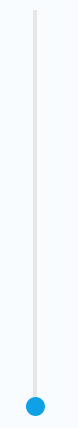

[HomePage](./Guide.md) 

# Slider
A slider lets users select a value from a continuous or discrete range of values by moving the slider thumb.

 

## Overview
Slider is a kind of common component and lets users select a value from a continuous or discrete range of values by moving the slider thumb.

- Use a slider to adjust the steps or strength of settings, such as the brightness and contrast.
- Sliders are classified into a horizontal type, vertical type depending on their orientation and the number of sliders that are adjusted simultaneously.

## Create with property
1. Create Slider by default constructor

~~~{.cs}
utilityBasicSlider = new Slider();
~~~

2. Set slider property

~~~{.cs}
utilityBasicSlider.TrackThickness = 4;
utilityBasicSlider.BgTrackColor = new Color(0, 0, 0, 0.1f);
utilityBasicSlider.SlidedTrackColor = new Color(0.05f, 0.63f, 0.9f, 1);
utilityBasicSlider.ThumbImageURLSelector = new StringSelector
{
    Normal = "controller_btn_slide_handler_normal.png",
    Pressed = "controller_btn_slide_handler_press.png",
};
utilityBasicSlider.ThumbSize = new Size2D(60, 60);
utilityBasicSlider.ThumbImageBackgroundURLSelector = new StringSelector
{
    Normal = "",
    Pressed = "controller_btn_slide_handler_effect.png",
};
utilityBasicSlider.Direction = Slider.DirectionType.Horizontal;
root.Add(utilityBasicSlider);
utilityBasicSlider.MinValue = 0;
utilityBasicSlider.MaxValue = 100;
utilityBasicSlider.CurrentValue = 10;
~~~

Slider created by property:

## Create with attributes
1. Create Slider attributes

~~~{.cs}
SliderAttributes sliderAttributes = new SliderAttributes
{
    TrackThickness = 4,
    BackgroundTrackAttributes = new ImageAttributes
    {
        BackgroundColor = new ColorSelector
        {
            All = new Color(0, 0, 0, 0.1f),
        }
    },

    SlidedTrackAttributes = new ImageAttributes
    {
        BackgroundColor = new ColorSelector
        {
            All = new Color(0.05f, 0.63f, 0.9f, 1),
        }
    },

    ThumbAttributes = new ImageAttributes
    {
        ResourceURL = new StringSelector
        {
            Normal = "controller_btn_slide_handler_normal.png",
            Pressed = "controller_btn_slide_handler_press.png",
        }
    },

    ThumbBackgroundAttributes = new ImageAttributes
    {
        Size2D = new Size2D(60, 60),
        ResourceURL = new StringSelector
        {
            Normal = "",
            Pressed = "controller_btn_slide_handler_effect.png",
        }
    }
};
~~~

2. Use the attributes to create a Slider and add it to parent

~~~{.cs}
utilityBasicSlider = new Slider(sliderAttributes);
utilityBasicSlider.Focusable = true;
utilityBasicSlider.Position2D = new Position2D(10, 10);
utilityBasicSlider.Size2D = new Size2D(50, 400);
utilityBasicSlider.Direction = Slider.DirectionType.Vertical;
root.Add(utilityBasicSlider);
~~~

Slider created by attributes:

## Create with defined styles
You can define a style according to the UX, then you can use the this style to ceate a slider.

1. User define a custom style as the whole view.

~~~{.cs}
internal class CustomSliderStyle : StyleBase
{
  protected override Attributes GetAttributes()
  {
      SliderAttributes attributes = new SliderAttributes
      {
          IsSelectable = true,
          BackgroundImageAttributes = new ImageAttributes
          {
              ResourceURL = new StringSelector { All = "rectangle_btn_normal.png" },
              Border = new RectangleSelector { All = new Rectangle(5, 5, 5, 5) }
          },

          ShadowImageAttributes = new ImageAttributes
          {
              ResourceURL = new StringSelector { All = "rectangle_btn_shadow.png" },
              Border = new RectangleSelector { All = new Rectangle(5, 5, 5, 5) }
          },

          OverlayImageAttributes = new ImageAttributes
          {
              ResourceURL = new StringSelector { Pressed = "rectangle_btn_press_overlay.png", Other = "" },
              Border = new RectangleSelector { All = new Rectangle(5, 5, 5, 5) },
          },

          TextAttributes = new TextAttributes
          {
              PointSize = new FloatSelector { All = 20 },
              HorizontalAlignment = HorizontalAlignment.Center,
              VerticalAlignment = VerticalAlignment.Center,
              WidthResizePolicy = ResizePolicyType.FillToParent,
              HeightResizePolicy = ResizePolicyType.FillToParent,

              TextColor = new ColorSelector
              {
                  Normal = new Color(0, 0, 0, 1),
                  Pressed = new Color(0, 0, 0, 0.7f),
                  Selected = Utility.Hex2Color(Constants.APP_COLOR_UTILITY, 1),
                  Disabled = new Color(0, 0, 0, 0.4f),
              },
          }
      };
      return attributes;
  }
}
~~~

2. Register your custom style.

~~~{.cs}
StyleManager.Instance.RegisterStyle("CustomSlider", null, typeof(YourNameSpace.CustomSliderStyle));
~~~

3. Use your custom style to create a slider instance

~~~{.cs}
utilityBasicSlider = new Slider("CustomSlider");
utilityBasicSlider.Focusable = true;
utilityBasicSlider.Position2D = new Position2D(10, 10);
utilityBasicSlider.Size2D = new Size2D(800, 50);
utilityBasicSlider.Direction = Slider.DirectionType.Horizontal;
root.Add(utilityBasicSlider);
~~~

## Responding to ValueChangedEvent
When user touch or pan a slider, the Slider instance receives a value changed event.
You can declare the value changed event handler as following:

~~~{.cs}
Slider slider = new Slider();
slider.ValueChangedEvent += OnValueChanged;
private void OnValueChanged(object sender, Slider.ValueChangedArgs args)
{
    // Do something in response to slider click
}
~~~

## Responding to StateChangedEvent
Slider has 8 states including Normal, Focused, Disabled, Selected, Pressed, DisabledFocused, SelectedFocused and DisabledSelected.
When the user change slider state ( change focus or disable a slider), the Slider instance receives an state changed event. You can declare the state changed event handler as following:

~~~{.cs}
Slider slider = new Slider();
slider.StateChangedEvent += OnStateChanged;
private void OnStateChanged(object sender, Slider.StateChangedArgs args)
{
    // Do something in response to state change
}
~~~

## Responding to SlidingFinishedEvent
When user finish a touch or pan operate on a slider, the Slider instance receives a slide finished event. You can declare the slide finished event handler as following:

~~~{.cs}
Slider slider = new Slider();
slider.SlidingFinishedEvent += OnSlidingFinished;
private void OnSlidingFinished(object sender, Slider.SlidingFinishedArgs args)
{
    // Do something in response to slide finished
}
~~~
