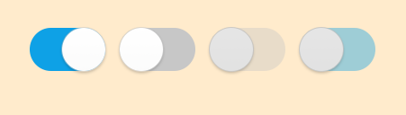
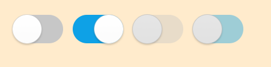
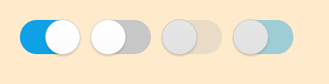

[HomePage](./Guide.md) 

# Switch
This tutorial describes how to create and use Popup.

## Overview
Switch is one kind of common component, it can be used as selector.

## Create with property
1. Create Switch by default constructor

~~~{.cs}
Switch[] utilitySwitch = new Switch[4];
~~~

2. Set switch property

~~~{.cs}
int num = 4;
for(int i = 0; i < num; i++)
{
    utilitySwitch[i] = new Switch();
    utilitySwitch[i].Size2D = new Size2D(96, 60);
    utilitySwitch[i].Position2D = new Position2D(300 + 100 * i, 300);
    utilitySwitch[i].SwitchHandlerImageSize2D = new Size2D(60, 60);
    utilitySwitch[i].SwitchBackgroundImageURLSelector = new StringSelector
    {
        Normal = "controller_switch_bg_off.png",
        Selected = "controller_switch_bg_on.png",
        Disabled = "controller_switch_bg_off_dim.png",
        DisabledSelected = "controller_switch_bg_on_dim.png",
    };
    utilitySwitch[i].SwitchHandlerImageURLSelector = new StringSelector
    {
        Normal = "controller_switch_handler.png",
        Selected = "controller_switch_handler.png",
        Disabled = "controller_switch_handler_dim.png",
        DisabledSelected = "controller_switch_handler_dim.png",
    };
    root.Add(utilitySwitch[i]);
}
utilitySwitch[2].IsEnabled = false;
utilitySwitch[2].IsSelected = false;
utilitySwitch[3].IsEnabled = false;
utilitySwitch[3].IsSelected = true;
~~~

Switch created by property:

## Create with attributes
1. Create switch attributes

~~~{.cs}
SwitchAttributes utilityAttrs = new SwitchAttributes
{
    IsSelectable = true,
    SwitchBackgroundImageAttributes = new ImageAttributes
    {
        ResourceURL = new StringSelector
        {
            Normal = "controller_switch_bg_off.png",
            Selected = "controller_switch_bg_on.png",
            Disabled = "controller_switch_bg_off_dim.png",
            DisabledSelected = "controller_switch_bg_on_dim.png",
        },
    },
    SwitchHandlerImageAttributes = new ImageAttributes
    {
        Size2D = new Size2D(60, 60),
        ResourceURL = new StringSelector
        {
            Normal = "controller_switch_handler.png",
            Selected = "controller_switch_handler.png",
            Disabled = "controller_switch_handler_dim.png",
            DisabledSelected = "controller_switch_handler_dim.png",
        },
    },
};
~~~

2. Use the attributes to create a switch and add switch to parent

~~~{.cs}
int num = 4;
for(int i = 0; i < num; i++)
{
    utilitySwitch2[i] = new Switch(utilityAttrs);
    utilitySwitch2[i].Size2D = new Size2D(96, 60);
    utilitySwitch2[i].Position2D = new Position2D(300 + 100 * i, 300);
    root.Add(utilitySwitch2[i]);
}
utilitySwitch2[2].IsEnabled = false;
utilitySwitch2[2].IsSelected = false;
utilitySwitch2[3].IsEnabled = false;
utilitySwitch2[3].IsSelected = true;
~~~

Switch created by attributes:

## Create with defined styles
You can define a style according to the UX, then you can use the this style to ceate a switch.

1. User define a custom style as the whole view.

~~~{.cs}
internal class CustomSwitchStyle : StyleBase
{
    protected override Attributes GetAttributes()
    {
        SwitchAttributes attributes = new SwitchAttributes
        {
            IsSelectable = true,
            SwitchBackgroundImageAttributes = new ImageAttributes
            {
                Size2D = new Size2D(96, 60),
                ResourceURL = new StringSelector
                {
                    Normal = "controller_switch_bg_off.png",
                    Selected = "controller_switch_bg_on.png",
                    Disabled = "controller_switch_bg_off_dim.png",
                    DisabledSelected = "controller_switch_bg_on_dim.png",
                },
            },
            SwitchHandlerImageAttributes = new ImageAttributes
            {
                Size2D = new Size2D(60, 60),
                ResourceURL = new StringSelector
                {
                    Normal = "controller_switch_handler.png",
                    Selected = "controller_switch_handler.png",
                    Disabled = "controller_switch_handler_dim.png",
                    DisabledSelected = "controller_switch_handler_dim.png",
                },
            },
        };

        return attributes;
    }          
}
~~~

2. Register your custom style.

~~~{.cs}
StyleManager.Instance.RegisterStyle("CustomSwitch", null, typeof(YourNameSpace.CustomSwitchStyle));
~~~

3. Use your custom style to create a switch instance

~~~{.cs}
int num = 4;
for(int i = 0; i < num; i++)
{
    switchControl[i] = new Switch("CustomSwitch");
    switchControl[i].Size2D = new Size2D(96, 60);
    switchControl[i].Position2D = new Position2D(300 + 100 * i, 300);
    root.Add(switchControl[i]);
}
switchControl[2].IsEnabled = false;
switchControl[2].IsSelected = false;
switchControl[3].IsEnabled = false;
switchControl[3].IsSelected = true;
~~~

Switch created by style:

## Responding to SelectedEvent
When user click switch, the Popup instance receives a SelectedEvent.
You can declare the event handler as following:

~~~{.cs}
Switch switchControl = new Switch();
switchControl.SelectedEvent += OnSelected;
private void OnSelected(object sender, Switch.SelectEventArgs e)
{
    //Do something when user select the switch
}
~~~
