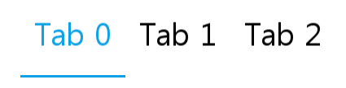
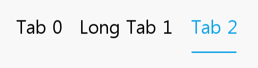
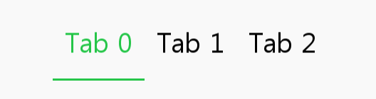

[HomePage](./Guide.md) 

# Tab
A tab makes it easy to explore and switch between different views or functional aspects of an app or to browse categorized data sets.

 

## Overview
Tab is a kind of common component, it can be used as menu label. User can handle Tab by adding/inserting/deleting TabItem.

- Tab can contain one or more tab items with text, usually used as menu label.
- Tab item can have different length.

## Create with property
1. Create Tab by default constructor

~~~{.cs}
utilityBasicTab = new Tab();
~~~

2. Set tab property

~~~{.cs}
utilityBasicTab.IsSelectable = true;
utilityBasicTab.Size2D = new Size2D(700, 108);
utilityBasicTab.Position2D = new Position2D(100, 300);
utilityBasicTab.BackgroundColor = new Color(1.0f, 1.0f, 1.0f, 0.5f);
utilityBasicTab.IsNatureTextWidth = true;
utilityBasicTab.ItemGap = 40;
utilityBasicTab.LeftSpace = 56;
utilityBasicTab.RightSpace = 56;
utilityBasicTab.TopSpace = 1;
utilityBasicTab.BottomSpace = 0;
utilityBasicTab.UnderLineSize2D = new Size2D(1, 3);
utilityBasicTab.UnderLineBackgroundColor = color[0];
utilityBasicTab.PointSize = 25;
utilityBasicTab.TextColorSelector = new ColorSelector
{
    Normal = Color.Black,
    Selected = color[0],
};
utilityBasicTab.ItemChangedEvent += TabItemChangedEvent;
root.Add(tab);

for (int i = 0; i < 3; i++)
{
    Tab.TabItemData item = new Tab.TabItemData();
    item.Text = "Tab " + i;
    if(i == 1)
    {
        item.Text = "Long Tab " + i;
    }
    utilityBasicTab.AddItem(item);
}
utilityBasicTab.SelectedItemIndex = 0;
~~~

Tab created by property:

## Create with attributes
1. Create tab attributes

~~~{.cs}
TabAttributes tabAttributes = new TabAttributes
{
    IsNatureTextWidth = false,
    Space = new Vector4(56, 56, 1, 0),
    UnderLineAttributes = new ViewAttributes
    {
        Size2D = new Size2D(1, 3),
        PositionUsesPivotPoint = true,
        ParentOrigin = Tizen.NUI.ParentOrigin.BottomLeft,
        PivotPoint = Tizen.NUI.PivotPoint.BottomLeft,
        BackgroundColor = new ColorSelector { All = color[0]},
    },
    TextAttributes = new TextAttributes
    {
        PointSize = new FloatSelector { All = 25 },
        TextColor = new ColorSelector
        {
            Normal = Color.Black,
            Selected = color[0],
        },
    },
};
~~~

2. Use the attributes to create a tab and add it to parent

~~~{.cs}
utilityBasicTab = new Tab(tabAttributes);
utilityBasicTab.Size2D = new Size2D(500, 108);
utilityBasicTab.Position2D = new Position2D(900, 300);
utilityBasicTab.BackgroundColor = new Color(1.0f, 1.0f, 1.0f, 0.5f);
utilityBasicTab.ItemChangedEvent += TabItemChangedEvent;
root.Add(utilityBasicTab);

for (int i = 0; i < 3; i++)
{
    Tab.TabItemData item = new Tab.TabItemData();
    item.Text = "Tab " + i;
    utilityBasicTab.AddItem(item);
}
utilityBasicTab.SelectedItemIndex = 0;
~~~

Tab created by attributes:

## Create with defined styles
You can define a style according to the UX, then you can use the this style to ceate a tab.

1. User define a custom style as the whole view.

~~~{.cs}
internal class CustomTabStyle : StyleBase
{
    protected override Attributes GetAttributes()
    {
        TabAttributes attributes = new TabAttributes
        {
            Space = new Vector4(56, 56, 1, 0),
            UnderLineAttributes = new ViewAttributes
            {
                Size2D = new Size2D(1, 3),
                PositionUsesPivotPoint = true,
                ParentOrigin = Tizen.NUI.ParentOrigin.BottomLeft,
                PivotPoint = Tizen.NUI.PivotPoint.BottomLeft,
                BackgroundColor = new ColorSelector { All = Color.Green },
            },
            TextAttributes = new TextAttributes
            {
                PointSize = new FloatSelector { All = 25 },
                TextColor = new ColorSelector
                {
                    Normal = Color.Black,
                    Selected = Color.Green,
                },
            },
        };
        return attributes;
    }
}
~~~

2. Register your custom style.

~~~{.cs}
StyleManager.Instance.RegisterStyle("CustomTab", null, typeof(YourNameSpace.CustomTabStyle));
~~~

3. Use your custom style to create a tab instance

~~~{.cs}
utilityBasicTab = new Tab("CustomTab");
utilityBasicTab.Size2D = new Size2D(500, 108);
utilityBasicTab.Position2D = new Position2D(900, 300);
utilityBasicTab.BackgroundColor = new Color(1.0f, 1.0f, 1.0f, 0.5f);
utilityBasicTab.ItemChangedEvent += TabItemChangedEvent;
root.Add(utilityBasicTab);

for (int i = 0; i < 3; i++)
{
    Tab.TabItemData item = new Tab.TabItemData();
    item.Text = "Tab " + i;
    utilityBasicTab.AddItem(item);
}
utilityBasicTab.SelectedItemIndex = 0;
~~~

## Responding to ItemChangedEvent
When user click an item on Tab, the Tab receives an iten change event.
You can declare the item change event handler as following:

~~~{.cs}
Tab tab = new Tab();
tab.ItemChangedEvent += TabItemChangedEvent;
private void TabItemChangedEvent(object sender, Tab.ItemChangeEventArgs e)
{
    createText[0].Text = "Create Tab just by properties, Selected index from " + e.PreviousIndex + " to " + e.CurrentIndex;
}
~~~
