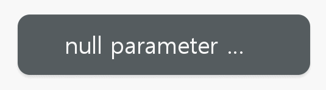
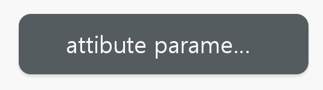

[HomePage](./Guide.md) 

# Toast
Use a toast to provide simple messages when the user does not need to make an additional action or confirmation.

## Overview
Toast is a kind of common component and provide simple messages. Unlike other popups, a toast only has the body field as it is just used for providing simple feedback to user actions. A toast will automatically disappear after a certain time.

- Toast only show simple messages contain with text.
- Toast can be automatically disappear after a certain time.

## Create with property
1. Create Toast by default constructor

~~~{.cs}
utilityBasicToast = new Toast();
~~~

2. Set Toast property

~~~{.cs}
utilityBasicToast.Position2D = new Position2D(50, 350);
utilityBasicToast.Size2D = new Size2D(512, 132);
utilityBasicToast.BackgroundImageBorder = new Rectangle(64, 64, 4, 4);
utilityBasicToast.TextArray = new string[1] { "null parameter construction" };
utilityBasicToast.PointSize = 26;
utilityBasicToast.TextColor = Color.White;
utilityBasicToast.BackgroundImageURL = "Poptoast_background.png";
utilityBasicToast.TextPaddingTop = 38;
utilityBasicToast.TextPaddingBottom = 38;
utilityBasicToast.TextPaddingLeft = 96;
utilityBasicToast.TextPaddingRight = 96;
utilityBasicToast.Duration = 1500;
~~~

Toast created by property:

## Create with attributes
1. Create Toast attributes

~~~{.cs}
ToastAttributes toastAttributes = new ToastAttributes
{
    Size2D = new Size2D(512, 132),
    TextAttributes = new TextAttributes
    {
        PaddingTop = 38,
        PaddingBottom = 38,
        PaddingLeft = 96,
        PaddingRight = 96,
        PointSize = new FloatSelector { All = 26 },
        TextColor = new ColorSelector { All = Color.White },
    },
    BackgroundImageAttributes = new ImageAttributes
    {
        ResourceURL=new StringSelector
        {
            All = "Toast Popup/toast_background.png",
        },
        Border = new RectangleSelector()
        {
            All = new Rectangle(64, 64, 4, 4),
        }
    },
    TextLineHeight = 56,
    TextLineSpace = 4,
    Duration = 3000,
};
~~~

2. Use the attributes to create a Toast and add Toast to parent

~~~{.cs}
utilityBasicToast = new Toast(toastAttributes);
utilityBasicToast.TextArray = new string[1] {"attibute parameter construction" };
utilityBasicToast.Position2D = new Position2D(650, 350);
utilityBasicToast.Duration = 1500;
root.Add(utilityBasicToast);
~~~

Toast created by property:

## Create with defined styles
You can define a style according to the UX, then you can use the this style to ceate a Toast.

1. User define a custom style as the whole view.

~~~{.cs}
internal class CustomToastStyle : StyleBase
{
    protected override Attributes GetAttributes()
    {
        ToastAttributes attributes = new ToastAttributes
        {
            Size2D = new Tizen.NUI.Size2D(512, 132),
            BackgroundImageAttributes = new ImageAttributes
            {
                ResourceURL = new StringSelector
                {
                    All = "Toast Popup/toast_background.png",
                },
                Border = new RectangleSelector
                {
                    All = new Tizen.NUI.Rectangle(64, 64, 4, 4)
                }
            },

            TextAttributes = new TextAttributes
            {
                PaddingTop = 38,
                PaddingBottom = 38,
                PaddingLeft = 96,
                PaddingRight = 96,
                PointSize = new FloatSelector { All = 26, },
                TextColor = new ColorSelector { All = Color.White, }
            }
        };
        return attributes;
    } 
}
~~~

2. Register your custom style.

~~~{.cs}
StyleManager.Instance.RegisterStyle("CustomToast", null, typeof(YourNameSpace.CustomToastStyle));
~~~

3. Use your custom style to create a Toast instance

~~~{.cs}
utilityBasicToast = new Toast("CustomToast");
utilityBasicToast.TextArray = new string[1] {"attibute parameter construction" };
utilityBasicToast.Position2D = new Position2D(650, 350);
utilityBasicToast.Duration = 1500;
root.Add(utilityBasicToast);
~~~
